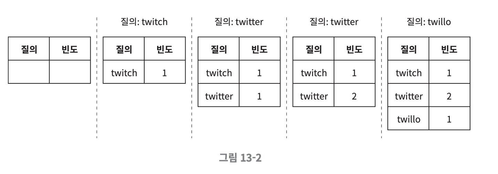
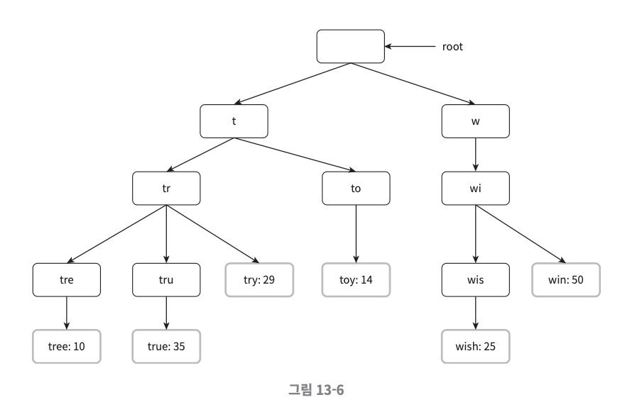
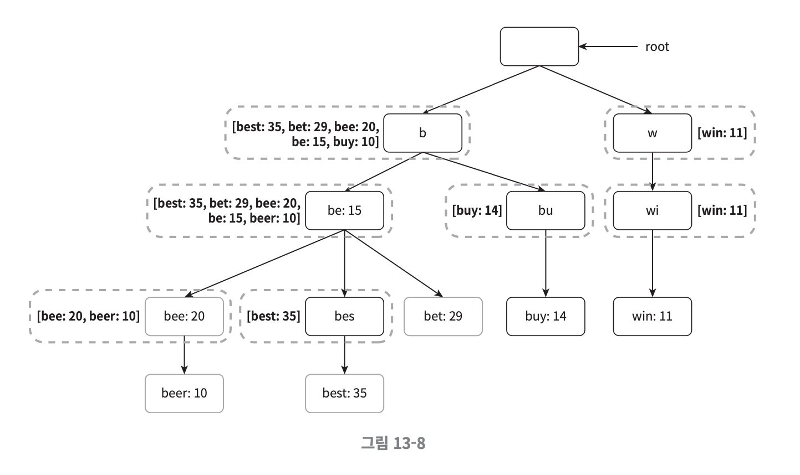
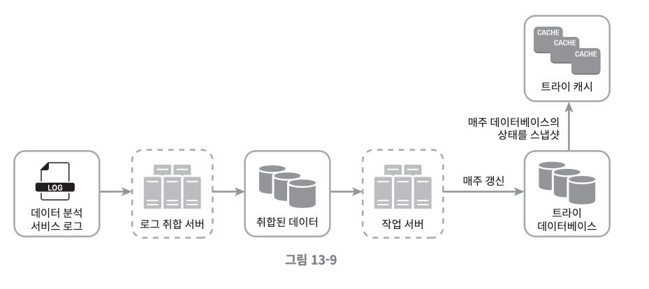
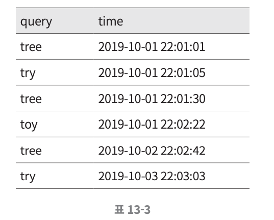
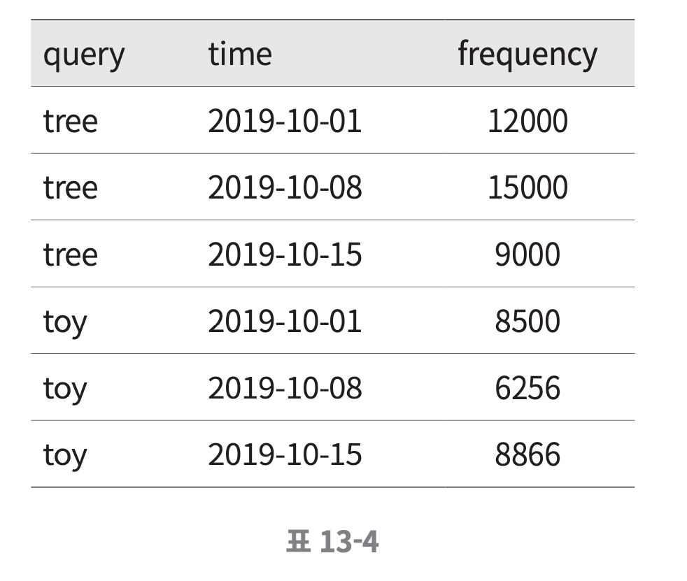
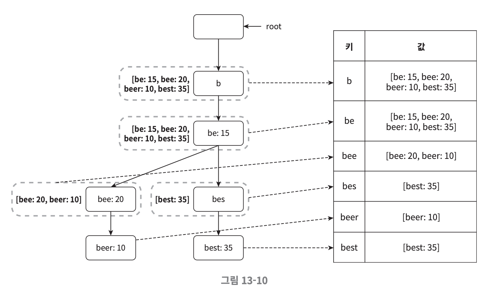
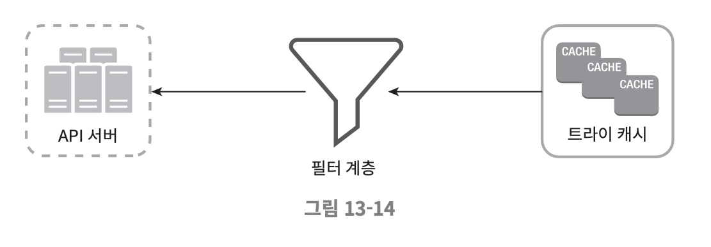
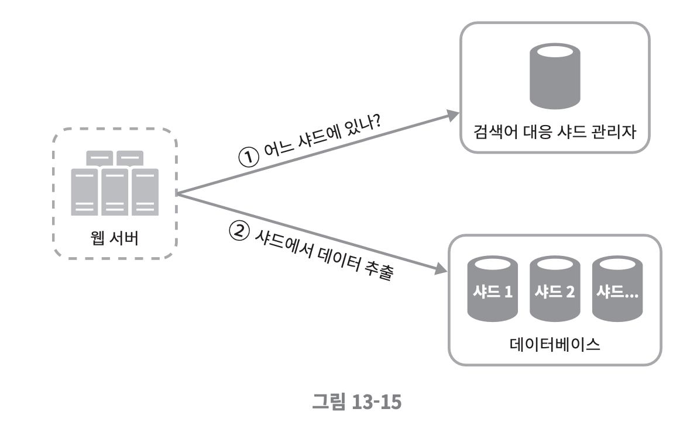

구글 검색 또는 아마존 웹 사이트 검색창에 단어를 입력하면 입력 중인 글자에 맞는 검색어가 자동으로 완성된다.

이런 기능은 검색어 자동완성(autocomplete)이라 부른다.

가장 많이 이용된 검색어 k개를 자동완성해서 출력하는 시스템을 설계해보자.

## 가정

먼저 요구사항을 분명히 해야 한다. 요구사항은 아래와 같다.
- 사용자가 입력하는 단어는 자동완성될 검색어의 첫 부분으로 한정한다.
- 자동완성 검색어는 5개가 표시된다.
- 검색 기준은 인기 순으로 한다.
- 맞춤법 검사 기능은 제공하지 않는다.
- 질의는 영어로 하지만 다국어 지원을 고려한다.
- 대문자나 특수문자는 처리하지 않는다.
- DAU 기준 천만 명의 사용자를 수용할 수 있어야 한다.
- 100ms 이내에 질의가 완료되어야 한다.
- 시스템의 일부에 장애가 발생하거나 예상치 못한 문제가 생겨도 시스템을 사용 가능해야 한다.

##### 개략적 규모 측정

- DAU는 천만 명으로 가정했다.
- 한 사용자가 평균적으로 매일 10건의 검색을 수행하는 상황을 가정
- 질의할 때마다 평균적으로 20 Byte의 데이터를 입력한다.
- 질의문은 4개 단어로 가정, 각 단어는 평균적으로 다섯 글자로 가정

만약 검색창에 dinner라고 입력하면 다음의 6개 요청이 백엔드에 전송된다.
- search?q=d
- search?q=di
- search?q=din
- search?q=dinn
- search?q=dinne
- search?q=dinner

유저는 평균적으로 20Byte를 사용하고 소문자는 ASCII 이므로 1byte이다. 클라이언트는 백엔드에 평균적으로 20개의 요청을 보내게 된다.
- 초당 24000 건의 질의(QPS = 24000)
  - 10,000,000(사용자 수) x 10(질의) x 20(자) x (1/3600(초)/24(시간))

추가로 질의 중 20%는 신규 검색어라고 가정한다.
- 매일 0.4GB의 신규 데이터가 추가된다.
  - 10,000,000(사용자 수) x 10(질의) x 20(자) x 20%

## 개략적 설계

지금까지 내용을 보면 시스템을 두 분류로 나눌 수 있다.
- 데이터 수집 서비스
  - 사용자가 입력한 질의를 실시간으로 수집
  - 데이터가 많은 애플리케이션에서 **실시간**은 바람직하지 않지만, 개략적 설계이므로 PASS
- 질의 서비스
  - 주어진 질의에 다섯 개의 인기 검색어를 정렬해서 노출

#### 데이터 수집 서비스

데이터 수집 서비스의 동작을 살펴보자.

사용자가 'twitch', 'twitter', 'twit-ter', 'twillo'를 순서대로 검색했다고 가정하자. 빈도 테이블(frequency table)은 아래처럼 채워진다.



#### 질의 서비스

다음 사용자가 'tw'로 검색했다면 질의서비스는 **빈도 테이블**에서 query가 'tw'로 시작하는 데이터를 frequency 내림차순으로 5개를 노출하면 된다.

```sql
SELECT * FROM frequency_table
WHERE query Like `prefix%`
ORDER BY frequency DESC
LIMIT 5;
```

하지만 이 부분에서는 데이터 양이 아주 많아지면 DB에서 병목이 충분히 생길 수 있다.

상세 설계에서는 자료 구조를 개선해서 질의를 효율적으로 개선하고 수평적으로 확장할 수 있는 방안을 모색해야 한다.

## 상세 설계

### 트라이 자료구조

개략적 설계에서는 **빈도 테이블**을 관계형 데이터베이스에 저장했다. 하지만 효율적이지 않다.
- 자료 구조를 바꿀 수 있지 않을까

트라이(trie, prefix tree)를 사용하면 이를 해결할 수 있다. 아래는 'tree', 'try', 'toy', 'with', 'win'이 보관된 트라이이다. 각 노드에는 빈도도 함께 저장한다.



그러면 트라이가 왜 효율적일까? 트라이에서 정의되는 용어는 아래와 같다.
- p: prefix의 길이
- n: 전체 노드의 개수
- c: 특정 노드의 자식 노드의 개수

여기서 가장 많이 사용된 질의어 k개는 다음과 같이 찾을 수 있다.
- 해당 prefix를 표현하는 노드를 찾는다. O(p)
- 해당 노드부터 시작하는 하위 트리를 탐색하여 모든 유효 노드를 찾는다. O(c)
- 유효 노드들을 정렬하여 가장 인기 있는 검색어 k개를 차즌ㄴ다. O(clog(c))

즉, 시간 복잡도는 `O(p) + O(c) + O(clog(c))`가 된다. 아직까지는 그렇게 효율적이지 않다.

여기서 최악의 경우에는 전체 트라이를 다 검색하는 일도 생길 수 있다. 이 부분은 아래와 같이 해결할 수 있다.
- 접두어의 최대 길이 제한
- 각 노드에 인기 검색어를 캐시

#### 접두어 최대 길이 제한

검색어에 긴 검색어를 입력하는 일은 거의 없다. 그래서 p값을 50과 같이 작은 정수라고 가정해도 안전하다.

검색어의 최대 길이를 제한할 수 있다면 `prefix를 표현하는 노드`를 찾는 단계의 시간 복잡도는 O(p)에서 O(1)이 된다.

#### 인기 검색어 캐시

각 노드에 k개의 인기 검색어를 저장해두면 전체 트라이를 검색하는 일을 방지할 수 있다.

예를 들면 `b` 노드에 가장 많이 검색되는 질의어인 `best`, `bet`, `bee`, `be`, `beer` 총 5개를 저장하는 것이다. 



결과적으로 접두어를 찾은 후 인기 검색어를 찾는 알고리즘의 복잡도가 O(1)이 된다.

#### 데이터 수집 서비스

위 구조는 트라이가 저장되어 있을 때에 한해서만 가능하다. 데이터를 수집해서 트라이에 저장하는 과정이 필요하다.

이때 고려해야 할 점은 아래와 같다.
- 질의 1번당 트라이를 1번 갱신한다면 엄청난 부하가 발생할 것이다.
- 트라이가 정착된 이후에는 인기 검색어는 자주 바뀌지 않을 수 있다. 자주 갱신할 필요가 없다.

실시간으로 트라이를 반영하지 않아도 무방하다고 한다면 아래와 같이 작업 서버에서 매주 갱신하는 구조를 사용할 수 있다.



**데이터 분석 서비스의 로그**는 수정이 불가능하며 아래 format을 가진다. 이는 Index를 가지지 않아도 된다.



**로그 취합 서버**는 데이터 분석 서비스의 로그를 통계하여 아래 format의 **취합된 데이터**를 만든다.



취합된 데이터는 해당 주에 해당 질의가 발생한 횟수를 가진다.

#### 트라이 데이터

**작업 서버**는 주기적으로 비동기 작업(Job)을 실행해서 **트라이 자료구조를 만들어서 DB에 반영**한다.

트라이는 **NoSQL** 중 Document DB나 Key-Value DB를 사용할 수 있다.

Key-Value DB를 선택하면 아래의 형태로 데이터를 저장할 수 있을 것이다.



#### 필터

폭령적이거나 성적인 단어 등은 자동완성 결과에서 제외해야 한다. 그래서 **필터 계층**을 두고 부적절한 질의어를 반환하지 않도록 할 수 있다.



필터 계층을 두면 필터 규칙에 따라 검색 결과를 핸들링 할 수 있다는 장점이 있다.

#### 수평적 규모 확장

단어의 수가 많아져서 1개 서버에서 관리할 수 없어질 수 있다.

알파벳의 사전 순 정렬대로 각 서버에 보관할 수도 있지만, 특정 샤드에 데이터가 몰릴 가능성이 존재한다.

그래서 **검색어 대응 샤드 관리자**를 추가한다.



검색어 대응 샤드 관리자는 **과거 질의 데이터**의 패턴을 분석하여 샤딩한다.

예를 들어 `s`로 시작하는 데이터와 자주 사용되지 않는 `u-z`의 데이터의 개수가 비슷하다면 `s`로 시작하는 단어에 샤드 1개와 `u-z`로 시작하는 단어가 저장될 샤드 1개를 분배할 수 있다. 

## 마무리

상세 설계를 마치면 아래의 요소들을 고려할 수 있다.
- 다국어 지원
  - 트라이에 유니코드를 저장한다.
  - 유니코드는 세상에 존재한느 모든 문자 체계를 지원
- 국가별로 인기 순위가 다르다면?
  - 국가별로 다른 트라이를 사용
- 실시간으로 변하는 검색어의 추이를 반영하려면?
  - 예를 들어 뉴스를 통해 특정 검색어의 인기가 갑자기 높아진다면
    - 샤딩을 통해 작업 대상 데이터의 양을 줄인다.
    - 순위 모델을 바꾸어 최근 검색어에 보다 높은 가중치를 준다.
    - Ha-doop, Spark, Kafka와 같은 스트림 프로세싱을 사용

## 참고
- https://velog.io/@tkdals0978/가상-면접-사례로-배우는-대규모-시스템-설계-기초-13장-검색어-자동완성-시스템
- https://www.yes24.com/Product/Goods/102819435