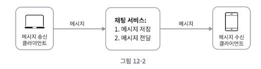
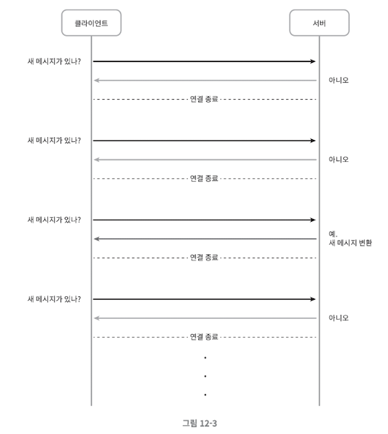
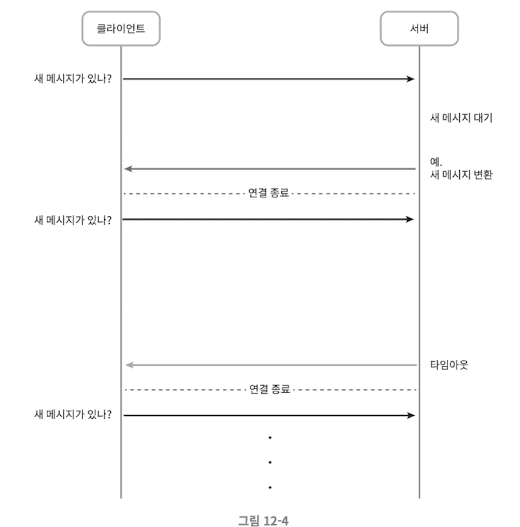
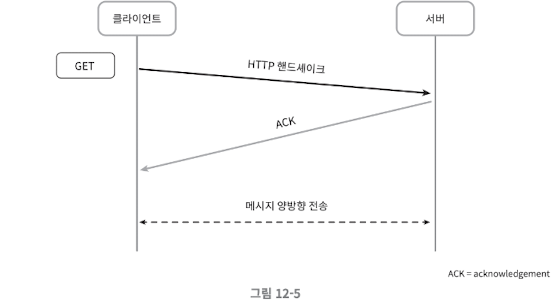
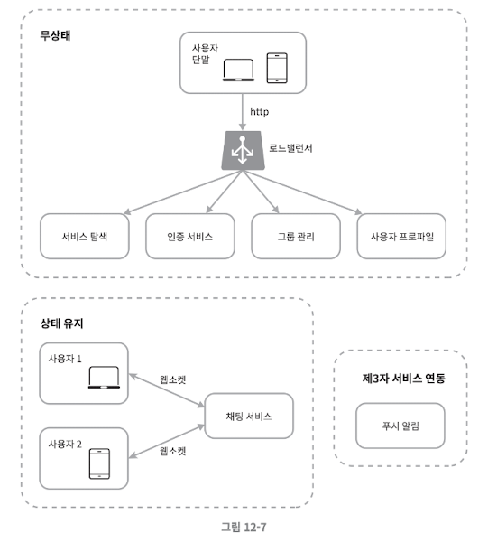
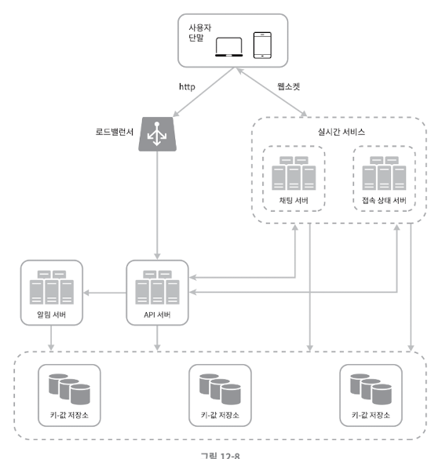

SNS 분산 아키텍처에서 사용할 채팅 시스템을 설계해보자. 아래는 현재 시장에서 널리 쓰이는 채팅 시스템의 나열이다.
- Whatsapp
- Facebook messenger
- Wechat
- Line
- Google Hangout
- Discord

여기서 Whatsapp, Wechat, Facebook Messenger는 1:1 채팅에 집중하고, Slack, Discord 등은 그룹 채팅과 낮은 Latency의 음성 채팅에 집중한다.

이렇게 채팅 시스템도 제각각 요구사항이 다르다. 그러니 **요구사항을 확실히** 해야 한다.

## 가정

이번에 설계할 시스템에서는 이해 관계자와의 합의 속에 아래의 가정을 했다고 하자.
- 1:1 채팅, 그룹 채팅을 모두 지원한다.
- 모바일 앱, 웹 앱을 모두 지원한다.
- DAU 기준 5천만 명을 처리할 수 있어야 한다.
- 그룹 채팅의 경우 100명까지 참가할 수 있다.
- 사용자 접속상태 표시를 지원해야 한다.
- 텍스트만 주고 받을 수 있다.
- 메시지 길이의 제한은 100,000자이다.
- 메시지 암호화는 현재로써는 필요 없다.
- 채팅 이력은 평생 보관해야 한다.
- 하나의 계정으로 여러 단말에서 동시 접속할 수 있다.
- 푸시 알림을 제공한다.

## 개략적 설계안

채팅 시스템의 경우 클라이언트는 서로 직접 통신하지 않고 채팅 서비스와 통신한다.

채팅 서비스는 아래의 역할을 수행해야 한다.
- 클라이언트들의 메시지 수신
- 메시지 수신자(recipient) 결정 및 전달
- 수신자가 접속(Online) 상태가 아닐 경우 접속할 때까지 메시지 보관

#### 프로토콜

매우 중요한 문제 중 하나가 클라이언트와 서버가 어떤 프로토콜로 통신할 지이다.

위 요구사항에서는 웹에서 널리 사용하고 메시지의 신뢰성을 보장하는 **HTTP**를 사용하면 될 것 같다.

#### 통신 기법

**폴링**

폴링 방식은 클라이언트가 주기적으로 서버에게 새 메시지가 있는 지 물어보는 방법이다.

하지만 새 메시지가 없을 때도 계속 물어보는 클라이언트와 대답해 줄 서버 모두 자원이 불필요하게 낭비될 수 있다.

**롱 폴링**

롱 폴링을 하면 이를 해결할 수 있다.

롱 폴링 방식도 문제가 있다.
- 분산 환경에서는 메시지를 받은 서버와 연결을 한 서버가 다를 수 있다.
- 서버 입장에서는 연결 상태를 알 수 없다.
- 여전히 연결을 여러 번 해서 자원 낭비가 발생한다.

**웹 소켓**

그래서 서버가 클라이언트에게 비동기(async) 메시지를 보낼 수 있는 웹 소켓 방식을 사용한다.

웹 소켓 방식은 아래의 장점을 제공한다.
- 커넥션을 한 번만 맺으므로 HTTP 요청 및 응답으로 인한 오버헤드를 줄일 수 있다.
- 실시간으로 양방향 통신이 가능하다.

더 자세한 내용은 아래 포스팅을 참고하자.
- https://jaehoney.tistory.com/362

아래는 해당 사항들을 반영한 개략적 설계안이다.

생소한 것은 서비스 탐색(Service Discovery) 서비스인데 특정 서버로 부하가 몰리지 않게 한다고 이해하면 될 것 같다.

여기서 부족한 점은 아래와 같다.
- 알림 서비스와의 연동
- SPOF(단일 병목/장애 포인트)

해당 부분을 개선한 설계안은 다음과 같다.

아래는 각 컴포넌트의 역할이다.
- 채팅 서버: 클라이언트 사이에 메시지를 중계
- 접속 상태 서버: 사용자의 접속 여부를 관리
- API 서버: 로그인, 회원가입, 프로파일 변경 등 채팅 이외 나머지를 관리
- 알림 서버: 푸시 알림을 전송
- 키-값 저장소: 채팅 이력(Chat history)를 보관

## 참고
- https://velog.io/@jay/software-architecture-chat