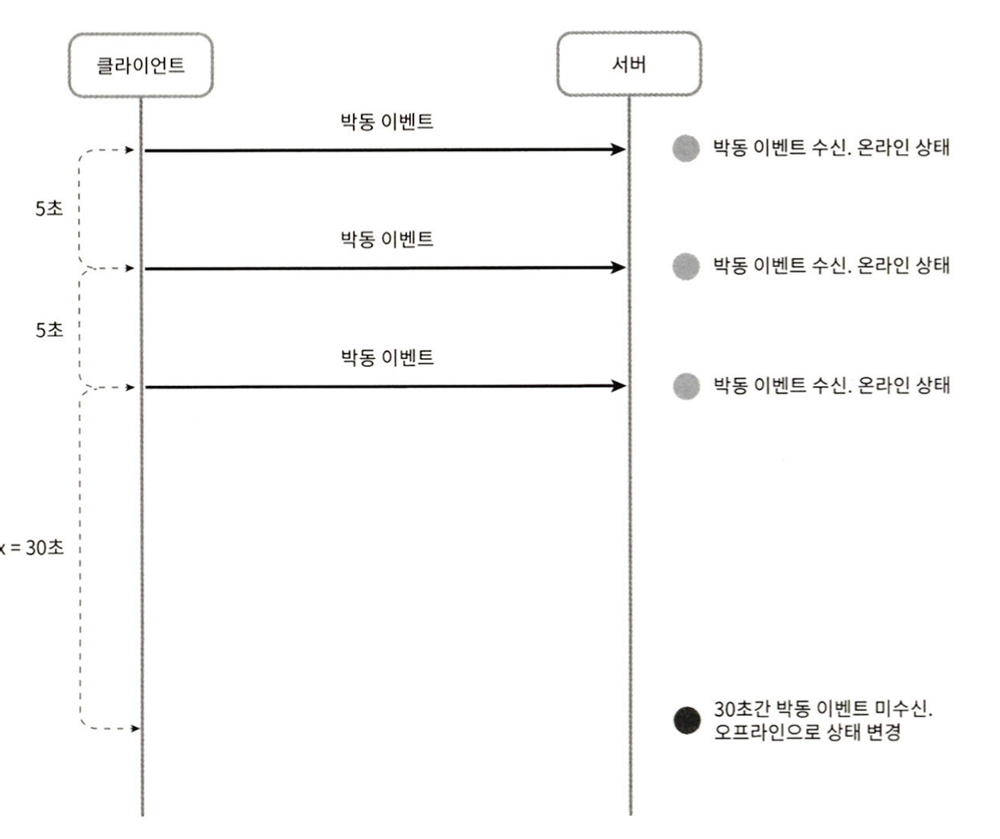

SNS 분산 아키텍처에서 사용할 채팅 시스템을 설계해보자. 아래는 현재 시장에서 널리 쓰이는 채팅 시스템의 나열이다.
- Whatsapp
- Facebook messenger
- Wechat
- Line
- Google Hangout
- Discord

여기서 Whatsapp, Wechat, Facebook Messenger는 1:1 채팅에 집중하고, Slack, Discord 등은 그룹 채팅과 낮은 Latency의 음성 채팅에 집중한다.

이렇게 채팅 시스템도 제각각 요구사항이 다르다. **요구사항을 확실히** 해야 한다.

## 가정

이번에 설계할 시스템에서는 이해 관계자와의 합의 속에 아래의 가정을 했다고 하자.
- 1:1 채팅, 그룹 채팅을 모두 지원한다.
- 모바일 앱, 웹 앱을 모두 지원한다.
- DAU 기준 5천만 명을 처리할 수 있어야 한다.
- 그룹 채팅의 경우 100명까지 참가할 수 있다.
- 사용자 접속상태 표시를 지원해야 한다.
- 텍스트만 주고 받을 수 있다.
- 메시지 길이의 제한은 100,000자이다.
- 메시지 암호화는 현재로써는 필요 없다.
- 채팅 이력은 평생 보관해야 한다.
- 하나의 계정으로 여러 단말에서 동시 접속할 수 있다.
- 푸시 알림을 제공한다.

## 개략적 설계

채팅 시스템의 경우 클라이언트는 서로 직접 통신하지 않고 채팅 서비스와 통신한다.

채팅 서비스는 아래의 역할을 수행해야 한다.
- 클라이언트들의 메시지 수신
- 메시지 수신자(recipient) 결정 및 전달
- 수신자가 접속(Online) 상태가 아닐 경우 접속할 때까지 메시지 보관

#### 프로토콜

매우 중요한 문제 중 하나가 클라이언트와 서버가 어떤 프로토콜로 통신할 지이다.

위 요구사항에서는 웹에서 널리 사용하고 메시지의 신뢰성을 보장하는 **HTTP**를 사용하면 될 것 같다.

#### 통신 기법

**폴링**

폴링 방식은 클라이언트가 주기적으로 서버에게 새 메시지가 있는 지 물어보는 방법이다.

하지만 새 메시지가 없을 때도 계속 물어보는 클라이언트와 대답해 줄 서버 모두 자원이 불필요하게 낭비될 수 있다.

**롱 폴링**

롱 폴링을 하면 이를 해결할 수 있다.

롱 폴링 방식도 문제가 있다.
- 분산 환경에서는 메시지를 받은 서버와 연결을 한 서버가 다를 수 있다.
- 서버 입장에서는 연결 상태를 알 수 없다.
- 여전히 연결을 여러 번 해서 자원 낭비가 발생한다.

**웹 소켓**

그래서 서버가 클라이언트에게 비동기(async) 메시지를 보낼 수 있는 웹 소켓 방식을 사용한다.

웹 소켓 방식은 아래의 장점을 제공한다.
- 커넥션을 한 번만 맺으므로 HTTP 요청 및 응답으로 인한 오버헤드를 줄일 수 있다.
- 실시간으로 양방향 통신이 가능하다.

더 자세한 내용은 아래 포스팅을 참고하자.
- https://jaehoney.tistory.com/362

### 반영된 설계안

아래는 해당 사항들을 반영한 **개략적 설계안**이다.

생소한 것은 서비스 탐색(Service Discovery) 서비스인데 특정 서버로 부하가 몰리지 않게 한다고 이해하면 될 것 같다.

여기서 부족한 점은 아래와 같다.
- 알림 서비스와의 연동
- SPOF(단일 병목/장애 포인트)

해당 부분을 개선한 설계안은 다음과 같다.

아래는 각 컴포넌트의 역할이다.
- 채팅 서버: 클라이언트 사이에 메시지를 중계
- 접속 상태 서버: 사용자의 접속 여부를 관리
- API 서버: 로그인, 회원가입, 프로파일 변경 등 채팅 이외 나머지를 관리
- 알림 서버: 푸시 알림을 전송
- 키-값 저장소: 채팅 이력(Chat history)를 보관

#### 데이터 저장소

이제 데이터 저장소를 선택해보자.

발생할 데이터는 아래의 특징을 가진다.
- 매일 600억 개의 메시지가 발생한다.
- 대부분 사용자는 최근에 받은 메시지만을 사용한다.
- 검색 기능을 이용하거나 특정 사용자가 언급된 메시지를 볼 수 있다.
  - 특정 메시지로 점프(Jump)하여 데이터에 접근할 수도 있다.
- 메시지를 수정할 수 없다.
- 1:1 채팅의 경우 읽기와 쓰기 비율은 약 1:1이다.

그래서 Key-Value 데이터베이스를 선택했다.
- 수평적 규모확장이 쉽다.
- 매우 낮은 Latency
- 관계형 DB는 롱 테일(Long tail)에 대한 접근 비용이 크고 질의가 어렵다.
- 많은 안정적인 채팅 시스템이 Key-Value DB를 사용한다. 페이스북 메신저는 HBase를 사용하고 디스코드는 Cassandra를 사용한다.

테이블 설계는 아래와 같다.

**message 테이블**

기본 키는 message_id로 하고 순서를 정하는 역할도 담당한다. 

| Json key     | Json value |
|--------------|------------|
| message_id   | bigint     |
| message_from | bigint     |
| message_to   | bigint     |
| content      | text       |
| created_at   | timestamp  |

**group message 테이블**

그룹 채팅을 위한 메시지 테이블은 channel_id, message_id의 복합 키를 기본 키로 사용한다.

그리고 chanel_id의 경우 파티션 키로 사용할 것이다.

| Json key     | Json value |
|--------------|------------|
| channel_id   | bigint     |
| message_id   | bigint     |
| message_from | bigint     |
| message_to   | bigint     |
| content      | text       |
| created_at   | timestamp  |

**메시지 ID**

message_id를 만드는 기법을 고민하자. message_id는 아래 요구사항을 만족해야 한다.
- message_id는 고유해야 한다.
- message_id는 정렬 가능해야 하며 시간 순서와 일치해야 한다. (새로운 ID는 이전 ID보다 큰 값이어야 한다.)

RDBMS를 메인 DB로 사용한다면 auto_increment를 사용할 수 있지만 NoSQL에서는 보통 해당 기능을 제공하지 않는다.

그래서 **스노플레이크**(트위터에서 사용하는 ID 생성 기법)를 사용하거나 메시지 순서가 채널 혹은 세션 안에서만 유지되어도 된다면 **지역적 순서 번호 생성기**로 구현할 수 있다.

## 상세 설계

### 서비스 탐색

서비스 탐색은 클라이언트에게 가장 적합한 채팅 서버를 추천해준다. 이때 사용되는 정보는 클라이언트의 위치와 서버의 용량 등이다.

아래는 서비스 탐색 기능을 구현하는 데 널리 쓰이는 Zookeeper를 사용한 상세 설계이다.

Flow에 대한 설명은 아래와 같다.
1. 사용자 A가 시스템에 로그인을 시도한다.
2. 로드밸런서가 로그인 요청을 API 서버 중 하나로 보낸다.
3. API 서버는 인증 처리를 완료한 후 서비스 탐색을 동작시킨다.
4. 사용자 A는 반환받은 채팅 서버와 웹소켓 연결을 맺는다.

### 메시지 흐름

아래 그림은 1:1 채팅에서 메시지의 흐름을 나타낸 것이다.

1. 사용자 A가 채팅 서버 1로 메시지 전송
2. 채팅 서버 1은 ID 생성기를 사용해 메시지 ID를 결정
3. 해당 메시지를 메시지 동기화 큐로 전송
4. 메시지를 키-값 저장소에 보관
5. a. 사용자 B가 접속 중인 경우 B가 사용 중인 채팅 서버로 메시지 전송, b. 사용자 B가 접속 중이 아니라면 푸시 알림 서버로 푸시 알림 메시지 전송
6. 채팅 서버 2는 사용자에게 웹소켓을 통해 메시지 전송

### 그룹 메시지

그룹 메시지의 경우 아래 Flow를 사용할 수 있다.

그렇지만 이 Flow는 아래 이유로 소규모 채팅방에서만 적합하다. 위챗(WeChat)이 해당 Flow와 유사하며 그룹의 크기가 500명으로 제한된다.
- 새로운 메시지가 왔는 지 확인하려면 자기 큐만 보면 되니까 동기화가 단순하다.
- 그룹이 크지 않으면 메시지를 수신자별로 복사해서 큐에 넣는 작업의 비용이 문제가 되지 않는다.
- 만약 그룹의 크기가 크면 큐에 넣는 작업 비용이 선형적으로 증가한다.

그래서 대규모 그룹의 경우 아래 Flow를 사용할 수 있다.

해당 Flow에서는 여러 큐에 데이터를 전부 동기화하지 않고 모든 사용자의 메시지를 수신한다.

### 접속 장애

개략적 설계안에서 접속상태 서버를 통해 사용자의 상태를 관리해서 온라인/오프라인 여부를 노출하도록 설계했다.

문제는 사용자의 연결이 매우 짧은 시간 끊어진 경우(터널에 들어간 경우 등)에도 접속 상태를 변경하면 부하도 크고 사용자 경험도 바람직하지 않다.

그래서 Health Check를 통해 접속 장애를 검사하고 반영한다.

해당 방법도 문제가 있는데 그룹 하나의 많은 사용자가 있는 경우이다.

위와 같이 접속상태 서비스에서 Pub/Sub 모델을 사용한다면 너무 많은 이벤트가 발행되는 문제가 있다.

그래서 접속 시점에서만 상태 정보를 읽어가던지 사용자가 수동으로 갱신하는 기능을 제공할 필요가 있다.

## 마무리

여기까지 상세 설계를 마치고 다음 내용을 추가로 논의할 수 있다.
- 채팅 앱을 확장하여 사진이나 비디오 등의미디어를 지원할 방법
  - 압축 방식, 클라우드 저장소, 썸네일 생성 등
- 메시지 암호화
- 캐시: 클라이언트에 이미 읽은 메시지를 캐싱해서 저장
- 오류 처리
  - 채팅 서버가 죽으면 다시 서비스 탐색을 통해 새로운 서버를 배정해서 접속
  - 메시지 발행/실패에 대한 재시도 처리

## 참고
- https://velog.io/@jay/software-architecture-chat
- https://jjingho.tistory.com/161