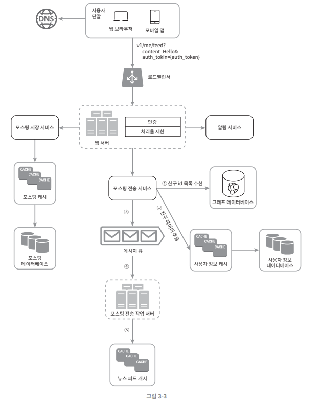
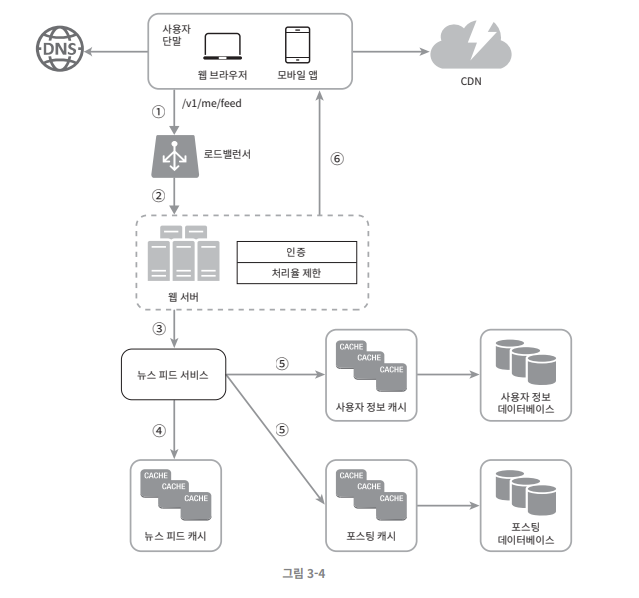
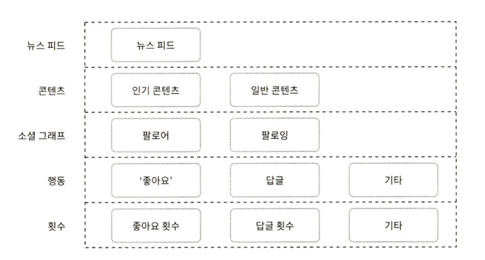

해당 포스팅은 가상 면접 사례로 배우는 대규모 시스템 설계 기초의 내용을 기반으로 한다.

**시스템 설계 4단계 접근법**으로 SNS 아키텍처를 설계하는 과정을 경험해보자!

## 1. 가정

설계를 하기 앞서 첫 번째로 해야할 것은 요구사항과 가정이다.

SNS 서비스 아키텍처를 설계를 한다고 했을 때 **속도를 최대한 늦춰서** **깊게 생각**하고 **가정을 명확히** 해야 한다. 이는 **잘못된 설계를 할 가능성을 방지**한다.

아래의 질문들을 통해 가정을 명확히할 수 있다.
- 구체적으로 어떤 기능들이 필요한 지?
  - 타임라인을 제공하는 것이 주요 기능인지? 정렬은 어떻게 되는 지?
  - 이미지 / 비디오 파일도 올려야 하는 지
  - 최대 팔로우 수는 몇명인지?
- 사용자 수는 얼마나 되는 지?
- 회사나 팀 규모는 어떻게 되는 지?
- 기술 스택은 어떻게 되는 지?

**가정**을 명확히 하고 **도메인을 정의**하는 과정은 **아무리 강조해도 부족**하다.

## 2. 개략적 설계 

가정이 끝나면 개략적인 설계부터 해야 한다. 개략적 설계안으로 핵심 컴포넌트를 포함해서 다이어그램에 그린다.
아래는 핵심 컴포넌트의 예시이다.
- 클라이언트(모바일/웹), API, 웹 서버, 데이터 저장소, 캐시, CDN, 메시지 큐

아래는 피드 발행과 피드 생성의 Flow를 개략적으로 설계한 것이다.

각 컴포넌트의 역할은 아래와 같다.
- 로드밸런서(load balancer): 트래픽을 웹서버로 분산한다.
- 웹 서버: HTTP 요청을 내부 서비스로 중계한다.
- 포스팅 저장 서비스: 새 포스팅을 DB와 캐시에 저장한다.
- 포스팅 전송 서비스: 새 포스팅을 친구의 뉴스 피드에 푸시(push)한다. 뉴스 피드 데이터는 캐시를 통해 읽어갈 수 있도록 처리한다.
- 알림 서비스: 친구들에게 새 포스팅이 올라왔음을 알리거나 푸시 알림을 보낸다.
- 뉴스 피드 캐시: 뉴스 피드를 렌더링할 때 필요한 피드 ID를 보관한다.

이제 개략적인 설계안을 기반으로 팀원들과 대화하고 제약사항들을 만족하는 지 계산해본다. 유즈케이스를 토대로 결함이 없는 지 체크해보면서 미처 고려하지 못한 엣지 케이스를 발견할 수 있다.

## 3. 상세 설계

동료들과 함께 개략적인 아키텍처에 대해서 대화를 끝내고 만족했고 대략적인 목표와 기능 범위를 확인했다. 이제 **주요한 컴포넌트부터 상세 설계**를 해야한다.

시스템의 **병목** 구간이나 **자원 요구량 추정치**에 초점을 맞춰서 컴포넌트들이 세부 **요구사항을 수용할 수 있는 지 체크**해야 한다. 예를 들면 아래의 문제들에 초점을 맞출 수 있다.
- Latency를 줄이고 온/오프라인 상태를 표시할 수 있는 방법
- 친구 목록을 추천할 방법
- 타임라인을 Pull 방식으로 설계할 지 Push 방식으로 설계할지
- Blocking I/O를 줄일 수 있는 방법
- ...

아래는 그 예시이다.

### 3-1. 피드 발행

피드 발행은 시점에 따라 Push 모델과 Pull 모델로 나눌 수 있다.

##### Push 모델

Push 모델은 새로운 포스팅을 등록하는 시점에 팔로워들의 뉴스 피드를 갱신하는 모델이다.

아래는 Push 모델의 특징이다.

- Write를 희생하고 Read가 빨라진다.
- 공간복잡도를 희생한다.
  - 타임라인을 저장할 공간이 필요하다.
- 서비스를 자주 이용하지 않는 사용자에 대한 성능 낭비가 발생한다.
- 정합성 보장에 대한 고민이 필요하다.
- 시스템 복잡도가 높다.
- Twitter가 사용한다.
  - 팔로잉 하루 최대 1,000명
  - 자신을 팔로우하는 사람이 늘어난다면 팔로잉 제한 5,000명을 초과할 수 있다.

##### Pull 모델

Pull 모델은 피드를 읽는 시점에 뉴스 피드를 갱신하는 모델이다.

아래는 Pull 모델의 특징이다.

- Read를 희생하고 Write가 간단하다.
- 시간 복잡도를 희생한다.
- 비활성 사용자에 대한 성능 낭비가 없다.
- 정합성 보장에 유리하다.
- Follow가 많은 회원일수록 처리가 매우 느리다.
- Facebook이 사용한다.
  - 친구 5,000명 제한

대부분의 사용자에게는 Push 모델을 사용하고, 인플루언서나 팔로워가 아주 많은 사용자의 경우 시스템 과부하 방지를 위해 Pull 모델 사용으로 결정했다고 가정한다.

- 그래프 DB 에서 친구 ID 목록을 가져온다.
- 사용자 정보 캐시에서 친구들의 정보를 가져온다. 그리고 사용자 설정에 따라 노출할 팔로워를 필터링한다.
- 친구 목록과 새 스토리의 포스팅 ID를 메시지 큐에 넣는다.
- 팬아웃 작업 서버가 뉴스피드 데이터를 뉴스 피드 캐시에 넣는다.
  - 전체 데이터를 저장하면 큰 부하가 생길 수 있으므로 `post_id, user_ids`만 전달한다.

### 3-2. 뉴스 피드 가져오기

발행된 피드를 뉴스 피드로 구독하는 시스템의 아키텍처는 아래와 같다.

- 이미지나 비디오와 같은 미디어 콘텐츠는 CDN에 저장한다.
- 웹 서버는 뉴스피드 서비스를 호출한다.
- 뉴스 피드 서비스는 뉴스 피드 캐시에서 포스팅 ID 목록을 가져온다.
- 뉴스 피드에 표시할 사용자 이름, 사용자 사진, 포스팅 컨텐츠 등을 사용자 캐시와 포스팅 캐시에서 가져와 뉴스 피드를 조합한다.
- 생성된 뉴스 피드를 JSON 형태로 클라이언트에게 보낸다.

각 시스템의 웹 서버는 인증과 초당 처리량 제한을 사용한다.

#### 초당 처리량 제한

DDoS 공격이나 스팸 게시물을 매크로 등록하는 등의 상황을 방지하려면 초당 처리량을 제한하는 장치가 필요할 수 있다.
처리량 제한은 웹 서버나 게이트웨이, 클라이언트, 서버 등에서 모두 처리할 수 있다.
- 초당 1회 이상의 게시글을 올리면 429(Too many requests)를 반환한다.

클라이언트에 두는 경우 위/변조가 가능하고, 서버의 경우 MSA 환경에서는 동일한 처리가 중복될 수 있고 관점 분리가 어렵다.

MSA로 개발한다면 웹 서버나 API 게이트웨이와 같은 미들웨어에서 처리하는 것이 적합할 것이다.
- 웹 서버나 API 게이트웨이를 선택했더라도 알고리즘에 대한 추가 설계가 필요하다.
- 초당 사용자의 요청횟수를 보관할 Redis와 같은 캐시가 필요할 수 있다.

#### 캐시

충분한 캐시는 뉴스 피드 시스템의 핵심 요소이다.

해당 설계안에서는 캐시를 아래와 같이 다섯 계층으로 나눈다.

예를 들어 뉴스 피드 캐시 계층은 콘텐츠, 소셜 그래프, 행동, 횟수 계층의 캐시를 참조해서 생성된다.

## 4. 마무리

이제 추가적인 논의를 진행할 수 있다.

##### DB 규모 확장
- 수직적 확장 vs 수평적 확장
- SQL vs NoSQL
- Master-Slave 다중화
- Replica에 대한 읽기 연산
- 일관성 모델
- 데이터베이스 샤딩

이외에도 아래의 주제 둥애 대해 논의할 수 있다.
- 무상태(Stateless) 유지하기
- 캐시 적중률 높이는 방법
- MQ를 사용하여 컴포넌트 사이의 결합도 낮추기
- 트랜잭션을 보장할 방법
- 병렬 프로그래밍 적용하기
- 팔로우가 더 많아지면 어떻게 될 지
- 메트릭이나 로그를 어떻게 수집해서 모니터링할 지

완벽한 아키텍처는 없다. 더 상세한 개선점이 충분히 나올 수 있다. **질문과 대화**를 가능한 많이 하기를 다시한번 강조한다. 절대 스스로 내린 가정이 옳다고 믿고 진행하면 안된다.

명쾌한 정답은 없다. 요구사항과 현재 상황에 맞는 최선책이 있을 뿐이다.
다음 포스팅에서는 이번에 설계했던 SNS 아키텍처의 알림 시스템 설계에 대해 다룬다.

## 참고

- https://product.kyobobook.co.kr/detail/S000001033116
- https://smpark1020.tistory.com/401
- https://thalals.tistory.com/441