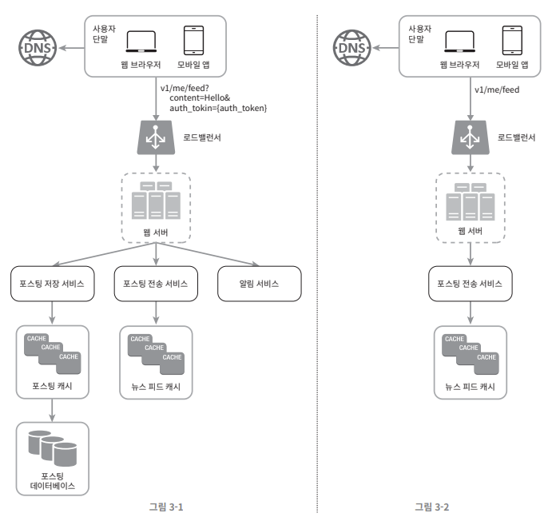
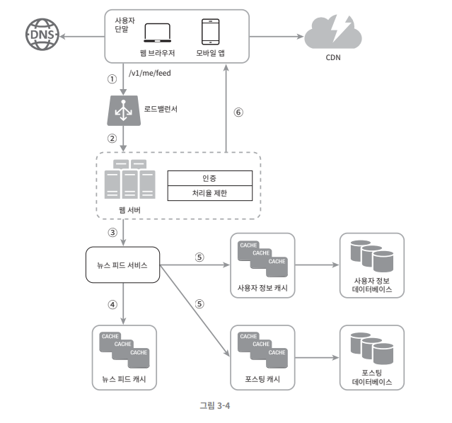

해당 포스팅은 가상 면접 사례로 배우는 대규모 시스템 설계 기초의 내용을 기반으로 한다.

## 0. 가정부터

설계를 하기 앞서 첫 번째로 해야할 것은 요구사항과 가정이다. SNS 서비스 아키텍처를 설계를 한다고 했을 때 속도를 최대한 늦춰서 깊이 생각하고 가정을 명확히 해야 한다. 이는 잘못된 설계를 할 가능성을 방지한다.

즉, 우리는 아래의 질문들을 통해 가정을 명확히할 수 있다.
- 구체적으로 어떤 기능들이 필요한 지?
  - 타임라인을 제공하는 것이 주요 기능인지? 정렬은 어떻게 되는 지?
  - 이미지 / 비디오 파일도 올려야 하는 지
  - 최대 팔로우 수는 몇명인지?
- 사용자 수는 얼마나 되는 지?
- 회사나 팀 규모는 어떻게 되는 지?
- 기술 스택은 어떻게 되는 지?

가정을 명확히 하는 과정은 아무리 강조해도 부족하다고 한다.

## 1. 개략적 설계 

가정이 끝나면 개략적인 설계부터 해야 한다. 개략적 설계안으로 핵심 컴포넌트를 포함해서 다이어그램에 그린다.
아래는 핵심 컴포넌트의 예시이다.
- 클라이언트(모바일/웹), API, 웹 서버, 데이터 저장소, 캐시, CDN, 메시지 큐

아래는 피드 발행과 피드 생성의 Flow를 개략적으로 설계한 것이다.

이제 개략적인 설계안을 기반으로 팀원들과 대화하고, 제약사항들을 만족하는 지 계산해본다.
추가로 유즈케이스를 토대로 결함이 없는 지 체크해보면서 미처 고려하지 못한 엣지 케이스를 발견할 수 있다.

## 2. 상세 설계

팀원들과 함께 개략적인 아키텍처에 대해서 대화를 끝내고, 팀원들도 만족한다면 주요한 컴포넌트부터 상세 설계를 해야한다.

이제 대략적인 목표와 기능 범위를 확인했으니 상세 설계를 해야 한다.
여기서 시스템의 병목 구간이나 자원 요구량 추정치에 초점을 맞춰서 컴포넌트들이 세부 요구사항을 수용할 수 있는 지 체크해야 한다. 예를 들면 아래의 문제들에 초점을 맞출 수 있다.
- Latency를 줄이고 온/오프라인 상태를 표시할 수 있는 방법
- 타임라인을 Pull 방식으로 설계할 지 Push 방식으로 설계할지
- Blocking I/O를 줄일 수 있는 방법
- ...

아래는 그 예시이다.

### 2-1. 피드 발행

### 2-2. 타임라인 가져오기

#### 초당 처리량 제한

DDoS 공격이나 스팸 게시물을 매크로 등록하는 등의 상황을 방지하려면 초당 처리량을 제한하는 장치가 필요할 수 있다.
처리량 제한은 웹 서버나 게이트웨이, 클라이언트, 서버 등에서 모두 처리할 수 있다.
- 초당 1회 이상의 게시글을 올리면 429(Too many requests)를 반환한다.

클라이언트에 두는 경우 위/변조가 가능하고, 서버의 경우 MSA 환경에서는 동일한 처리가 중복될 수 있고 관점 분리가 어렵다.

MSA로 개발한다면 웹 서버나 API 게이트웨이와 같은 미들웨어에서 처리하는 것이 적합할 것이다.
- 웹 서버나 API 게이트웨이를 선택했더라도 알고리즘에 대한 추가 설계가 필요하다.
- 초당 사용자의 요청횟수를 보관할 Redis와 같은 캐시가 필요할 수 있다.

## 3. 마무리

이제 추가적인 논의를 진행할 수 있다. 완벽한 아키텍처는 없다. 더 상세한 개선점이 충분히 나올 수 있다.
- Reactive Programming이 필요한 것은 아닌 지
- 팔로우가 더 많아지면 어떻게 될 지
- 트랜잭션은 어떻게 보장할 지
- 메트릭이나 로그를 어떻게 수집해서 모니터링할 지
- ...

다시한번 강조하지만, **질문과 대화**를 가능한 많이 해야 한다. 절대 스스로 내린 가정이 옳다고 믿고 진행하면 안된다.

그리고 명쾌한 정단읍 없다. 요구사항과 현재 상황에 맞는 최선책이 있을 뿐이다.

##

## 참고

- https://product.kyobobook.co.kr/detail/S000001033116
- https://smpark1020.tistory.com/401
- https://thalals.tistory.com/441