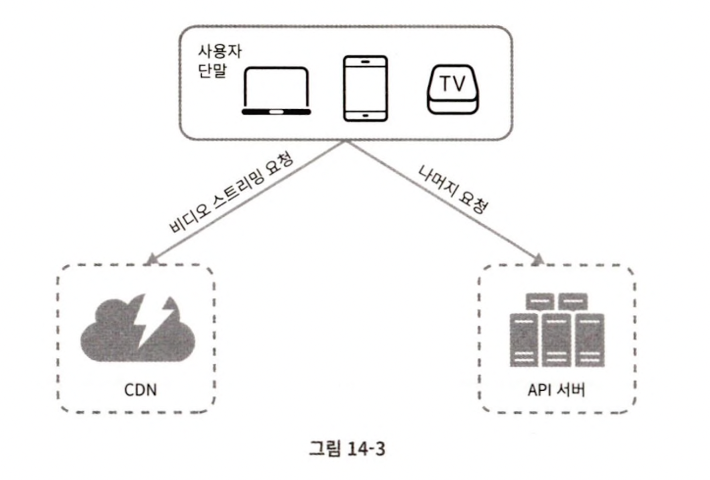
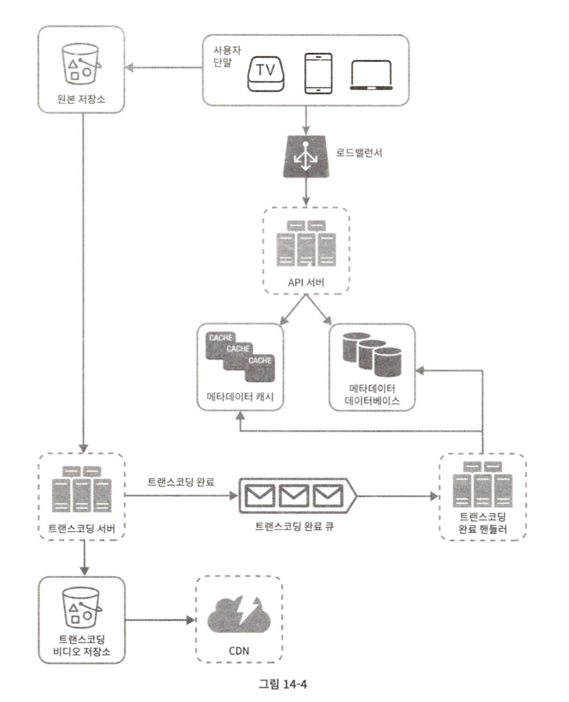
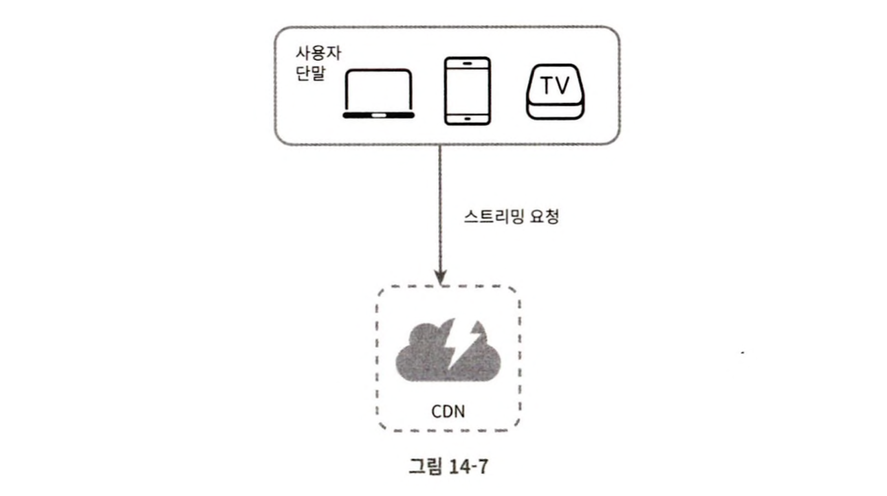
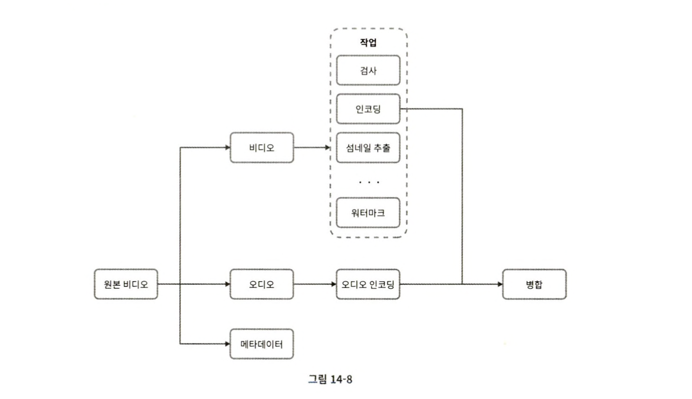
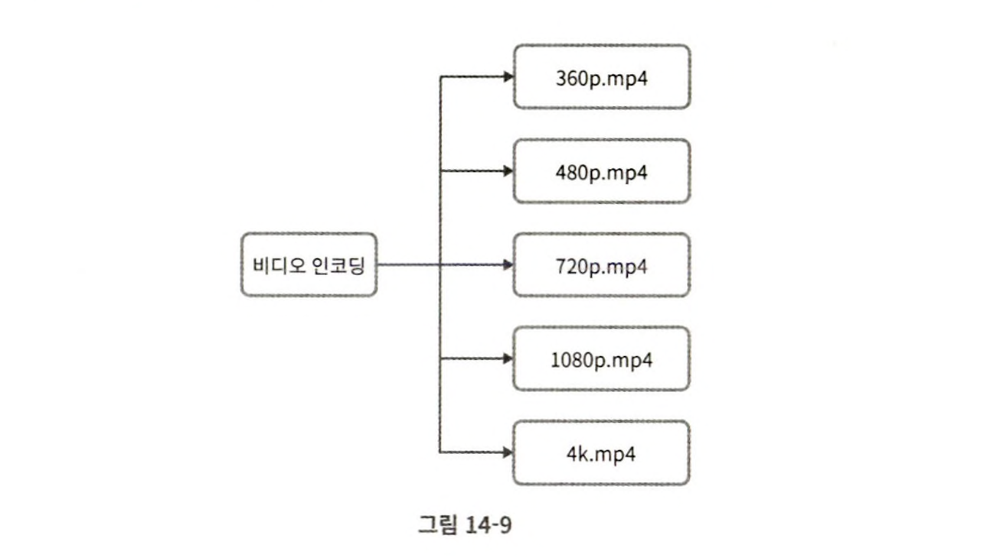
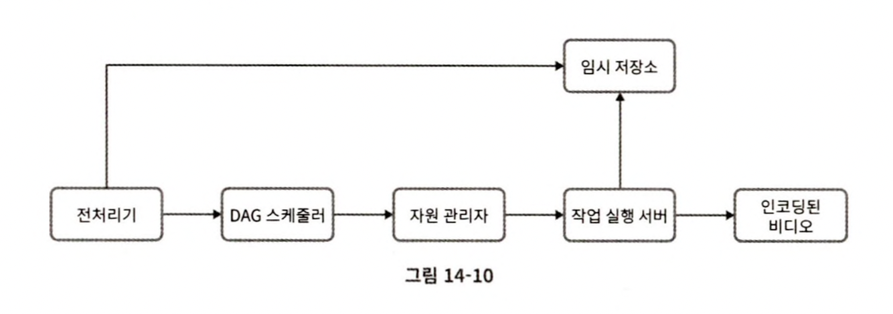
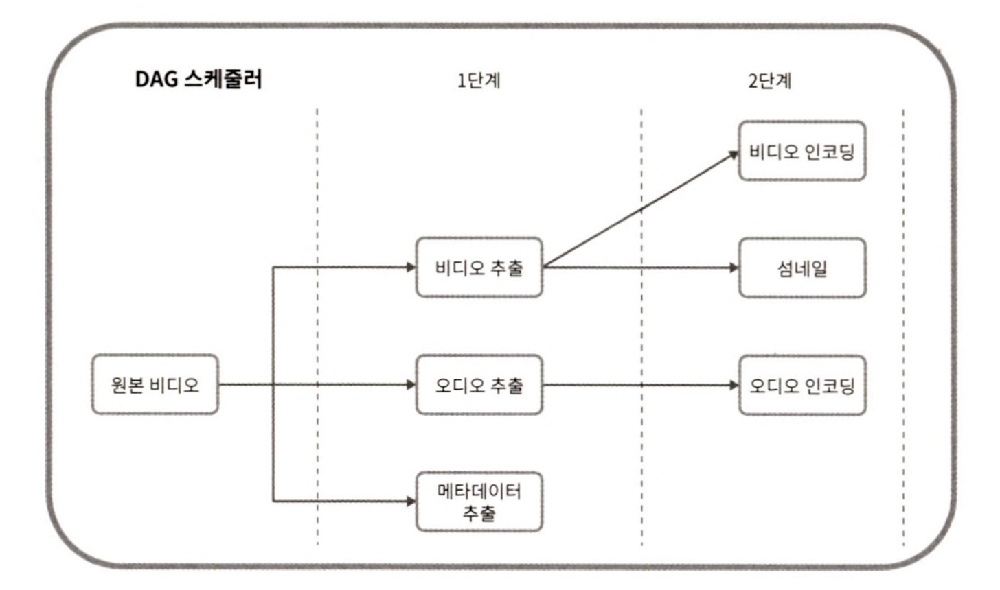
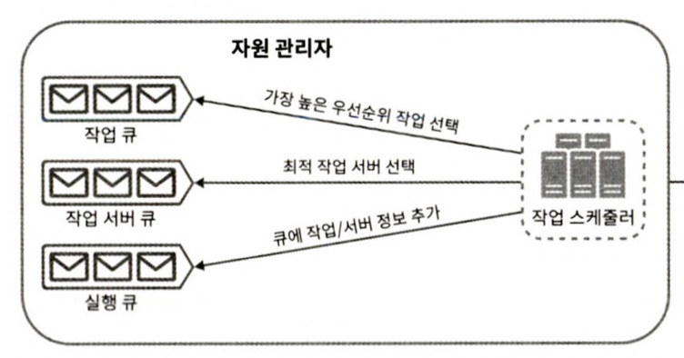

요즘 너무 설계 내용만 포스팅해서 유튜브 설계 내용은 포스팅하지 않겠다고 생각했는데..

유튜브 설계 내용이 생각외로 되게 재밌어서 또 포스팅하게 됬다!

이번 포스팅은 **가상 면접 사례로 배우는 대규모 시스템 설계 기초**에 기반한 내용이다.

## 개략적 설계

유튜브 시스템은 언뜻 보기에는 간단해 보일 수 있지만 실제로는 굉장히 복잡하다. 아래는 유튜브에 대한 통계 자료이다.
- MAU: 21억
- 매일 재생되는 비디오 수: 50억
- 5천만 명의 창작자
- 모바일 인터넷 트래픽 가운데 37%를 점유
- 2019년 기준 연간 광고 수입이 150억 달러
- 80개 언어로 이용 가능

기본적으로 유튜브는 단순히 비디오를 생성하고 보는 것 이외에도 댓글, 공유, 좋아요, 재생목록, 채널, 구독 등과 같은 다양한 기능을 제공한다. 해당 기능들을 이번 포스팅에서 다 다루기는 어려렵다. 아래 설계에서는 비디오를 업로드하고 재생하는 것에 집중한다.

#### 요구사항

- 가장 중요한 기능: 비디오를 올리고 시청하는 기능
- 클라이언트: 모바일 앱, 웹 브라우저, 스마트 TV
- 일간 능동 사용자 수: 500만 명
- 10% 사용자가 하루에 1개의 비디오 업로드
- 다국어 지원: 모든 언어로도 이용 가능해야 함
- 비디오 해상도: 현존하는 대부분을 지원
- 암호화 필요: O
- 비디오 파일 크기: 최대 1GB로 제한 (크지 않은 Size에 집중)
- AWS, GCP, Azure의 클라우드 서비스 활용 가능 여부: O

아래는 성능. 안정성에 대한 요구사항 명세이다.
- 빠른 비디오 업로드
- 원활한 재생
- 재생 품질 선택 기능
- 낮은 인프라 비용
- 높은 가용성과 규모 확장성, 안정성

#### 클라우드 비용 산정

아래는 클라우드 비용을 산정한 것이다.
- 일간 능동 사용자 수는 500만 명, 한 사용자는 하루 평균 5개의 비디오 시청, 10% 사용자가 하루에 1개의 비디오 업로드
- 비디오 평균 크기는 300MB
- 비디오 저장을 위해 매일 새로 요구되는 저장 용량 = 500만 x 10% x 300MB = 150TB
- CDN 비용 (미국에서 발생을 가정): 500만 x 5비디오 x 0.3GB x $0.02 = $150,000

이 추정 결과에 따르면 CDN을 통해 비디오를 서비스하면 비용이 엄청나다. 위 비용을 줄일 수 있는 방안도 상세 설계에서 고민해보자.

## 개략적 설계

아래는 쉽게 생각할 수 있는 설계이다. 

각 컴포넌트의 역할은 아래와 같다.
- 단말: 컴퓨터, 폰, 스마트 TV 등을 통해 유튜브를 시청할 수 있다.
- CDN: 비디오는 CDN에 저장한다. 재생을 하면 CDN으로부터 스트리밍이 이루어진다.
  - 넷플릭스도 AWS를 사용하고 페이스북도 아카마이의 CDN을 사용한다.
- API 서버: 비디오 스트리밍을 제외한 모든 요청은 API 서버가 처리한다. 피드 추천, 비디오 업로드 URL 생성, DB 및 캐시 갱신, 사용자 가입 등을 수행

스트리밍의 경우 CDN 서버에서 스트리밍을 요청하면 된다. 비디오 업로드 부분을 설계해보자.

#### 비디오 업로드

최초 비디오 업로드 설계안은 아래와 같다.

정리하면 아래의 두 프로세스가 병렬적으로 수행된다.

**비디오 업로드**

- 비디오를 원본 저장소에 저장
- 트랜스코딩 서버는 원본 저장소에서 비디오를 가져와 트랜스코딩을 수행
- 트랜스코딩이 완료되면 아래 두 절차를 병렬로 수행
  - 완료된 비디오를 트랜스코딩 저장소로 업로드한다.
    - 트랜스코딩이 끝난 비디오를 CDN에 올린다.
  - 트랜스코딩 완료 이벤트를 트랜스코딩 완료 큐에 넣는다.
    - 완료 핸들러가 이벤트를 큐에서 꺼낸다.
    - 메타데이터 DB와 캐시를 갱신한다.
- API 서버가 단말에게 스트리밍 준비가 되었다고 알림
  
**메타데이터 갱신**

- 단말은 병렬적으로 비디오 메타데이터 갱신 요청을 API 서버에 보낸다.
  - 파일 이름, 크기, 포맷 등
- API 서버는 이 정보로 메타데이터 DB와 캐시를 업데이트한다.

각 컴포넌트는 아래 역할을 수행한다.
- API 서버: 비디오 스트리밍을 제외한 다른 모든 요청을 처리한다.
- 메타데이터 DB: 비디오의 메타데이터를 보관한다.
  - 샤딩(Sharding)과 복제(Replication)를 적용해서 성능 및 가용성 요구사항을 충족한다. 
- 메타데이터 캐시: 성능을 높이기 위해 비디오 메타데이터와 사용자 객체는 캐시한다.
- 원본 저장소: 원본 비디오를 보관할 대형 이진 파일 저장소(BLOB) 시스템이다. 
- 트랜스코딩 서버: 비디오의 포맷(MPEG, HLS 등)을 변한해서 단말이나 대역폭에 맞는 최적의 비디오 스트림을 제공하기 위해 필요하다.
- 트랜스코딩 비디오 저장소: 트랜스코딩이 완료된 비디오를 저장하는 BLOB 저장소이다.
- CDN: 비디오를 캐시하는 역할
- 트랜스코딩 완료 큐: 비디오 트랜스코딩 완료 이벤트를 보관할 메시지 큐
- 트랜스코딩 완료 핸들러: 트랜스코딩 완료 큐에서 이벤트를 꺼내서 메타데이터 캐시와 DB를 갱신할 작업 서버

#### 비디오 스트리밍

비디오 스트리밍은 비교적 간단하며 CDN을 통해서 이루어진다.

각 단말기마다 가장 가까운 CDN을 사용하기 때문에 전송지연에 대한 문제는 크게 일어나지 않는다.

주의해야 할 점은 프로토콜마다 지원하는 비디오 인코딩과 플레이어가 다르다는 것이다.

## 상세 설계

#### 비디오 트랜스코딩

특정 단말에서 생성한 비디오가 다른 단말에서도 원활하게 재생되려면, 다른 단말과 호환되는 비트레이트로 저장되어야 한다.

비디오 트랜스코딩은 다음 이유로 아주 중요하다.
- 가공되지 않은 원본 비디오는 저장 공간을 아주 많이 차지한다.
- 상당 수의 단말과 브라우저는 특정 종류의 비디오 포맷만 지원하기 때문에 호환성 문제를 해결하려면 1개의 비디오를 여러 포맷으로 인코딩해야 한다.
- 사용자의 네트워크 대역폭, 인터넷 속도에 따라 끊김 없는 재생을 보장하기 위해 360p, 720p, 1080p 등 다양한 화질로 인코딩해두어야 한다.

##### DAG

비디오에서 워터마크를 표시하고 싶은 사용자와 섬네일 이미지를 직접 제작하고 싶은ㅇ 사용자, 고화질 비디오를 선호하는 사람 등 다양하다.

페이스북의 스트리밍 비디오 엔진은 DAG(Directed Acyclic Graph) 모델을 도입한다. 
그래서 아래와 같이 적절한 추상화를 도입한 모델이 필요하다.

##### 인코딩

아래는 비디오 인코딩을 한 결과이다.

##### 아키텍처

위 내용을 바탕으로 작성한 트랜스코딩의 아키텍처는 아래와 같다.

각 컴포넌트의 역할은 아래와 같다.

**전처리기**
- 비디오 분할: GOP(Group of Pictures) 단위로 비디오를 쪼개는 것을 오래된 단말이나 브라우저에서 지원하지 않는다. 그 경우 비디오 스트림을 몇 초 단위로 잘게 쪼갠다.
- DAG 생성: 클라이언트의 설정에 따라 DAG를 만든다.
- 데이터 캐시: 분할된 비디오의 메타데이터를 임시 저장소에 저장한다.

**DAG 스케줄러**

DAG 그래프를 몇 개의 단계로 분할한 다음 각 작업을 해당 작업 관리자의 작업 큐에 넣는다.

**자원 관리자**

자원 배분을 효과적으로 수행한다.

아래는 각 컴포넌트의 역할이다.
- 작업 큐: 실행할 작업이 보관된 우선순위 큐
- 작업 서버 큐: 작업 서버의 가용 상태 정보가 보관된 우선순위 큐이다.
- 실행 큐: 현재 실행 중인 작업 및 작업 서버 정보가 보관되어 있는 큐이다.
- 작업 스케줄러:
  - 최적의 작업/서버를 골라 해당 작업 서버가 작업을 수행하도록 지시한다.
  - 해당 작업이 어떤 서버에게 할당 되었는지에 관한 정보를 실행 큐에 넣는다.
  - 작업이 완료되면 해당 작업을 실행 큐에서 제거한다.

### 마무리

실제로 유튜브가 이러한 설계를 기반했는 지는 알 수 없지만 위 설계 내용이 굉장히 탄탄하다고 느꼈다.

가정한 트래픽이 매우 높았고, 가정한 기능도 다양했기 때문에 이러한 설계도 할 수 있었던 것 같다.

다시 한 번 가정의 필요성을 느끼게 되었다.

## 참고

- https://velog.io/@kyy00n/대규모-시스템-설계-기초-유튜브-설계