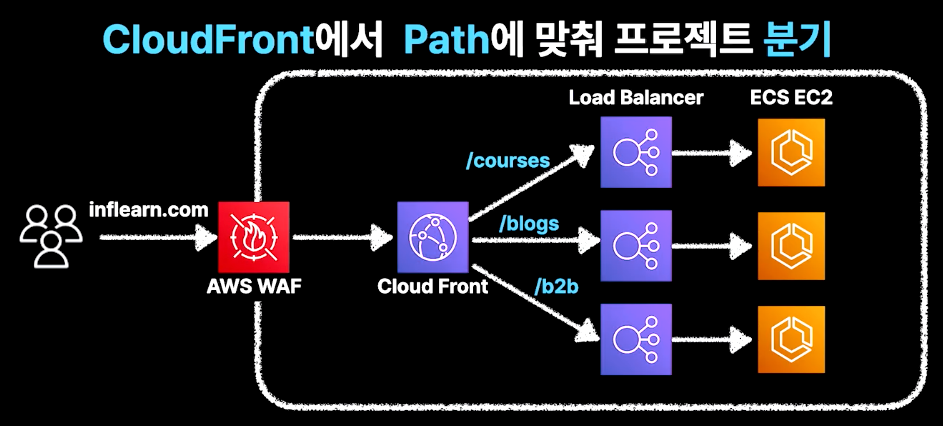

## IAC

N개의 동일한 인프라를 코드로 실행해서 생성할 수 있음

Pulumi
- 선언형 언어가 아니라서 IDE 활용, 추상화된 설계 가능
- 가장 훌륭한 문서 품질
- ESLint/Prettier, 모노 레포 등으로 코드 품질 관리 가능
- Jest를 활용한 단위 테스트

## CloudFront

인프런에서 뒤 /path에 따라서 각 서버로 분산

## GraphQL

URL Path 단위로 변화가 필요하기 때문에 단일 EndPoint를 사용하는 GraphQL은 도입할 수 없음

## 내부 API 호출 증가

1. 내부 서비스 호출에도 DNS 서버로 요청을 보내야 함

그래서 아래 단점이 존재

- 외부 DNS를 거쳐가야 하는 네트워크 리소스
- 외부 트래픽으로 계산되는 트래픽 비용
- 사내 와이파이, VPN 기반의 내부망 구성 어려움

그래서 Public(VPC) Load Balancer -> Private(VPC) Load Valancer로 전환

2. 모든 API가 성공해야 함

- MQ로 분리

단, 강한 일관성 모델이 아닐 때만 사용

## 도메인 클래스 중복

Github Registry에 공통으로 사용하자 등

여기서는 각자 프로젝트에서 필요한 최소한 만큼만 가져가자!로 했다.

