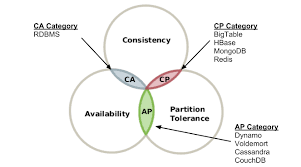

Key-Value 저장소는 대표적으로 Dynamo, Memcached, Redis와 같은 것들이 있다.

## 설계 범위 확정

먼저 해당 Key-Value Database의 목적을 명확히 할 필요가 있다.

아래의 특성을 목표로 가정한다.
- 대용량 데이터 저장 가능
- 짧은 Latency
- HA 확보
- 일관성을 조정할 수 있어야 함

### 단일 서버 ?

단일 서버에서는 사실 비교적 쉽다.

데이터를 메모리에 Map형태로 저장하기만 하면 된다.

다만, 메모리가 부족해지는 문제를 해결하기 위해 아래 기법을 적용할 수 있다.
- 데이터 압축(compression)
- 캐싱 (자주 쓰이지 않으면 디스크에 저장)

### 분산 서버

분산 서버를 설계할 떄는 CAP 이론을 이해해야 한다.

CAP 이론(Consistency, Availability, Partition Tolerance theorem)은 아래 세 가지 요구사항을 만족하는 분산 시스템을 설계하는 것은 불가능하다는 이론이다.
- 데이터 일관성: 분산 시스템에 접속하는 모든 클라리언트는 어떤 노드에 접속하던 같은 데이터를 볼 수 있다.
- 가용성: 분산 시스템에 접속하는 클라이언트는 일부 노드에 장애가 발생해도 응답을 받을 수 있어야 한다.
- 파티션 감내: 파티션(두 노드 사이에 통신 장애)가 발생하더라도 시스템이 정상 동작 되어야 한다.

이들 중 최소 1개는 내어줘야 한다는 얘기다.
- CP 시스템: 가용성을 희생한 경우
- AP 시스템: 일관성을 희생한 경우
- CA 시스템: 파티션 감내를 희생한 경우 (관계형 DB가 이에 속한다.)

## 참고

- https://dongwooklee96.github.io/post/2021/03/26