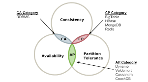
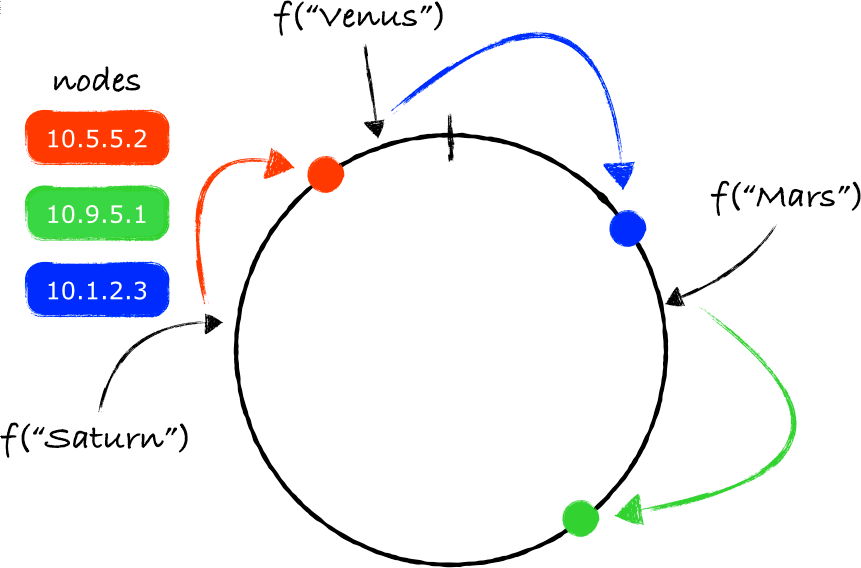

분산이 가능한 DB는 대표적으로 Dynamo, Memcached, Redis와 같은 것들이 있다.

먼저 분산 서버를 저장하기 위한 저장소의 목적을 명확히 할 필요가 있다.
- 대용량 데이터 저장 가능
- 짧은 Latency
- HA 확보
- 강한 일관성
- ...

### 단일 서버 ?

단일 서버에서는 사실 비교적 쉽다.

데이터를 메모리에 Map형태로 저장하기만 하면 된다.

다만, 메모리가 부족해지는 문제를 해결하기 위해 아래 기법을 적용할 수 있다.
- 데이터 압축(compression)
- 캐싱 (자주 쓰이지 않으면 디스크에 저장)

### 분산 서버

분산 서버를 설계할 떄는 CAP 이론을 이해해야 한다.

CAP 이론(Consistency, Availability, Partition Tolerance theorem)은 아래 세 가지 요구사항을 만족하는 분산 시스템을 설계하는 것은 불가능하다는 이론이다.
- C - 데이터 일관성: 분산 시스템에 접속하는 모든 클라리언트는 어떤 노드에 접속하던 같은 데이터를 볼 수 있다.
- A - 가용성: 분산 시스템에 접속하는 클라이언트는 일부 노드에 장애가 발생해도 응답을 받을 수 있어야 한다.
- P - 파티션 감내: 파티션(두 노드 사이에 통신 장애)가 발생하더라도 시스템이 정상 동작 되어야 한다.

이들 중 최소 1개는 내어줘야 한다는 얘기다.
- CP 시스템: 가용성을 희생한 경우
- AP 시스템: 일관성을 희생한 경우
- CA 시스템: 파티션 감내를 희생한 경우 (관계형 DB가 이에 속한다.)

여기서 만약 CP를 선택한다면 세 서버 사이에서 불일치 문제를 해결하기 위해 쓰기 연산을 정지시킬 수 있다. 그러면 가용성이 깨진다.

반면, 쓰기 연산을 허용하여 불일치를 허용하는 경우가 있다. 이게 AP 시스템이다. AP 시스템은 CP 시스템에 비해 시스템이 중단 없이 운영될 수 있다.
- 대부분 NoSQL 데이터베이스는 CP / AP로 구현하게 된다.
- 대용량의 분산 시스템에서는 일관성 기준을 낮춰도 문제가 없다면 일반적으로 AP를 선택한다.

분산 키-값 저장소를 만들 때는 CAP 이론을 활용하여 **도메인에 적합한 시스템**을 구성해야 한다.

### 데이터 파티션

대규모 애플리케이션의 경우 전체 데이터를 한 대 서버에 모두 저장하는 것은 불가능하다.

그래서 여러대의 작은 파티션들로 분할하여 저장한다. 데이터 파티션을 **Sharding(샤딩)** 이라고 한다.

이러한 샤딩은 **안정 해시** 방식으로 풀어낼 수 있다.

안정 해시 방식에서는 해시 링(Hash ring)의 특정 키의 해시값 지점에서 시계 방향으로 순회하다 만나는 첫 번째 서버에 데이터를 저장하게 된다.

### 가용성

높은 가용성과 안정성을 확보하기 위해서는 데이터를 N개 서버에 비동기적으로 다중화(replication)해야 한다.

N개 서버를 선택하는 기준은 위에서 말한 안정 해시 방식과 동일하다.

여기서 중요한 점은 N개의 서버가 같은 물리 서버면 안된다.
- If kakao 에서도 나왔던 내용이다!

다중화(또는 이중화)의 진정한 의미는 물리적으로도 독립된 서버에 저장해야  한다는 것을 의미한다. 그래야 정전, 자연재해 등으로 부터 각 서버를 격리시킬 수 있다.

### 데이터 일관성

다중화된 데이터는 적절히 동기화가 되어야 한다. 정족수 합의(Quorum Consensus) 프로토콜을 사용하면 읽기/쓰기 연산 모두에 일관성을 보장할 수 있다.

- N - 사본 개수
- W - 쓰기 연산에 대한 정족수 (쓰기 연산이 성공으로 간주되려면 적어도 W개의 서버에서 성공 응답을 받아야 한다.)
- R - 읽기 연산에 대한 정족수 (읽기기 연산이 성공으로 간주되려면 적어도 R개의 서버에서 성공 응답을 받아야 한다.)

여기서 도메인 요구사항에 따라 N, W, R을 적절히 선택하면 된다.
- R=1, W=N: 빠른 읽기 연산에 최적화된 시스템
- R=N, W=1: 빠른 쓰기 연산에 최적화된 시스템
- W+R > N: 강한 일관성이 보장됨
- W+R <= N: 빠른 연산, 느슨한 일관성

### 일관성 모델

일관성 모델은 데이터 일관성의 수준을 결정하는데 크게 3가지가 있다.
- 강한 일관성(String consistency): 모든 읽기 연산은 가장 최근에 갱신된 결과를 반환한다.
- 약한 일관성(Weak consistency): 읽기 연산은 오래된 결과를 반환할 수 있다.
- 최종적 일관성(Eventual consistency): 약한 일관성의 한 형태로 갱신 결과가 결국에는 모든 사본에 반영된다.

강한 일관성을 달성하는 일반적인 방법은 데이터를 쓸 때 모든 사본에 데이터를 쓰는 것에 대한 원자성을 보장하면 된다. 이런 방식은 고가용성 시스템에는 적합하지 않다. (데이터를 쓰는 동안 해당 데이터에 대해 읽기/쓰기를 할 수 없기 때문)

그래서 Dynamo, Cassandra의 경우 최종적 일관성 모델을 선택하고 있다.

원자적 연산이어야 하는 각 서버에 쓰는 작업이 병렬적으로 실행할 경우 일관성이 깨질 수 있는데 이는 클라이언트가 해결해야 한다.

## 참고

- https://dongwooklee96.github.io/post/2021/03/26/cap-%EC%9D%B4%EB%A1%A0%EC%9D%B4%EB%9E%80.html
- https://akshatm.svbtle.com/consistent-hash-rings-theory-and-implementation