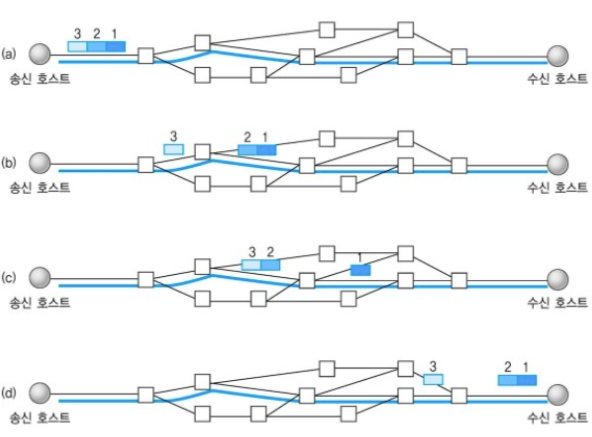
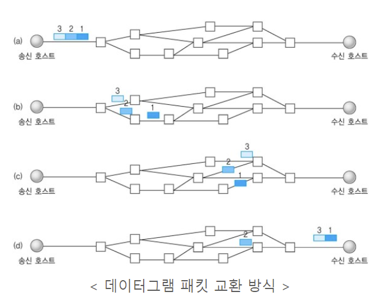

## TCP

- 연결 지향 방식으로 패킷 교환 방식을 사용한다.
- 높은 신뢰와 안정성을 지향한다.
- 3-way hand shake 방식으로 연결하고 4-way hand shake 방식으로 연결을 해제한다.
- 흐름제어, 혼잡제어로 신뢰성을 보장한다.
- 전이중(Full-Duplex), 점대점(Point to Point) 방식이다.

## UDP

- 비연결형 서비스로 데이터그램 방식이다.
- 데이터의 전송 순서가 바뀔 수 있다.
- 정보를 전달할 때 연결 시도나 신호 절차를 거치지 않는다.
- UDP 헤더의 CheckSum 필드를 통해 최소한의 오류만 검출한다.
- 수신자가 수신했는 지 확인할 수 있는 방법이 없다.
- 데이터그램 단위(65535Byte)로 전송되며, 크기가 초과하면 잘라서 보낸다.
- TCP보다 속도가 빠르다.
- 패킷의 손실보다는 실시간성을 중요시하는 증권 시세 플랫폼, 온라인게임, 화상통화, 실시간 채팅 등에서 많이 사용된다. 

## 참고
- https://dev-coco.tistory.com/144
- https://mangkyu.tistory.com/15