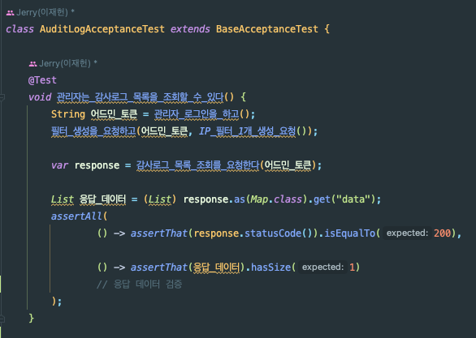
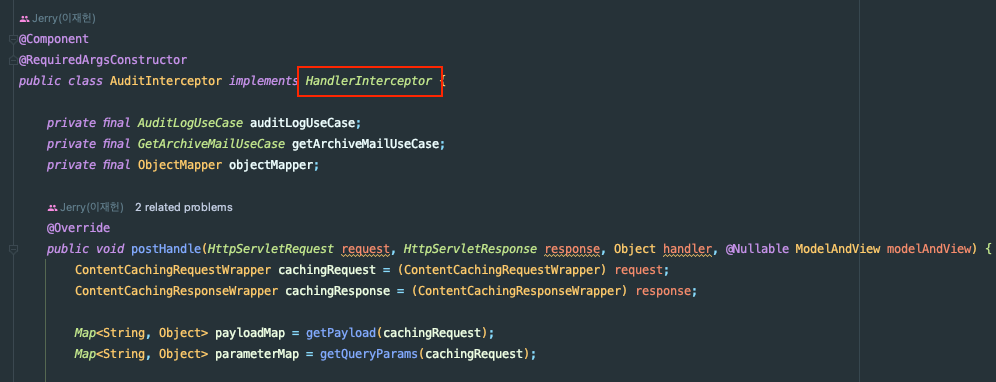
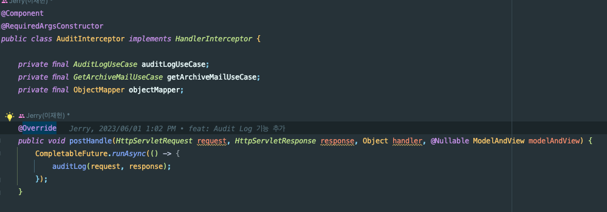
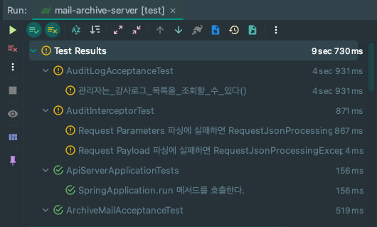

## 인수 테스트에서 비동기 로직 테스트하기!

개발하던 아카이브 메일 서버에서 인수 테스트를 짜다가 발생한 상황이다.

문제가 발생하는 인수 테스트 로직은 아래와 같다.

1. 아카이브 필터 생성
2. 감사 로그 조회

코드는 아래와 같다.

## 비동기 처리

감사 로그는 관점을 분리하고자 `Interceptor`를 통해 구현했었다.

요청이 완료되었을 때 요청 및 응답 정보를 DB에 저장한다.
- 참고로 Spring에서 요청은 Filter -> DispatchServlet -> Interceptor -> Controller -> 비즈니스 순으로 흐른다.
- 반대는 당연히 역순!

그러다가 로그를 남기는 부분 때문에 사용자의 메인 기능 요청에 Latency가 생겨서는 안된다고 생각했다.

그래서 위와 같이 비동기로 작업을 처리하도록 변경했다.

### 테스트

테스트 돌려보니 당연히 깨졌다..

- 단위 테스트 2건
- 인수 테스트 1건

어떻게 하면 될까..?

### JUnit

## 1. Sleep

