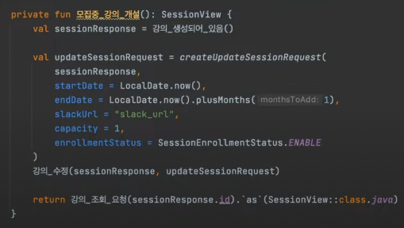

## ATDD 적용하기!

## 인수 테스트

인수 테스트는 시나리오(사용자 스토리) 기반으로 기능을 테스트하는 것이다.



- 배포 없이 빠른 피드백을 받을 수 있다.
- 도메인과 서비스 파악에 큰 도움이 된다.
- QA 절차 없이 테스트 코드만으로도 동작을 검증할 수 있다.

## TDD 문제..?

테스트 코드를 어떻게 시작할 지..? 언제 끝날지..?

각 단위들이 통합이 잘 되는 지..?

레거시 코드의 테스트 작성은 더 막막하다.

## ATDD가 해결할 수 있는 문제

그래서 ATDD(인수 테스트 주도 개발)을 하면 위 문제들을 해결할 수 있다.

ATDD로 큰 틀(인수 조건)을 먼저 작성한 후 그거에 맞춰서 단위 테스트를 작성할 수 있다.
- 작업의 시작과 끝이 명확해져서 심리적인 안정감에 도움을 준다.
- 이해 관계자들이 요구사항을 일관되게 이해할 수 있다.

## ATDD 사이클

ATDD의 개발 사이클은 아래와 같다.


## 인수 테스트 작성

ATDD를 작성할 때는 먼저 인수 테스트가 충족해야 하는 조건을 작성한다. 예를 들어 아래와 같이 작성할 수 있다.

```
given
  강사는 강의를 생성했다.
  강사는 강의를 신청 가능 상태로 변경했다.
  강의 모집인원 만큼 신청을 받았따.
when
  회원이 수강 대기 신청을 요청한다.
then
  회원은 강의의 수강 대기자로 등록 되었다.
``` 

해당 조건을 바탕으로 테스트를 작성하는데, 중요한 점은 사용자 관점에서 실제로 요청을 보내고 요청을 받는다는 점이다.

코드로 표현하면 아래와 같다.


## 인수 조건 작성

인수 테스트의 조건은 아래의 기준으로 작성한다.
- 검증하고자 하는 when 구문 먼저 작성
- 기대 결과를 의미하는 then 구문 작성
- when과 then에서 필요한 정보를 given에서 마련

## 인수 테스트 특징

인수 테스트는 내부 구조나 작동과 연관이 없는 Black box 테스트에 해당한다.
- 사용자 관점에서 잘 동작하는 지에 집중한다.

UI 레벨에서 인수 테스트를 하면 변동성이 커서 깨지기 쉽고, 백엔드 개발자에게 부담스럽다. 그래서 API 레벨에서 인수 테스트를 작성해나간다.

## 인수 테스트 도구

인수 테스트 시 아래의 테스트 도구를 활용할 수 있다.

서버
- @SpringBootTest

클라이언트
- MockMVC, WebTestClient, RestAssured

### WebEnvironment

인수 테스트에서는 실제 사용자 환경과 가장 유사한 @SpringBootTest를 사용한다.


- @SpringBootTest의 webEnvironment = RANDOM_PORT 또는 DEFINED_PORT 설정을 사용한다. 
  - Tomcat, netty 실제 웹 환경과 유사한 환경을 구축할 수 있다.
  - 별도의 쓰레드에서 스프링 컨테이너가 실행되어서 트랜잭션이 롤백되지 않을 수 있다.
  - default 값은 MOCK으로 실제 ServletContainer를 띄우지 않는다.

> 참고: https://mangkyu.tistory.com/264

### RestAssured 

webEnvironment = RANDOM_PORT로 사용하면 MockMvc는 사용할 수 없다.


WebTestClient의 경우에는 WebFlux의 패키지 안에 포함되어있고, Nettty를 기본으로 사용한다.

RestAssured를 사용하면 실제 내장 Tomcat에 요청을 보내고 응답을 받을 수 있다.


그래서 스프링 부트 포트를 RestAssured.port에 주입해줄 수 있다.

### 초기화

위에서 언급했듯 RANDOM_PORT를 사용하면서 트랜잭션이 롤백되지 않을 수 있다.

즉, 다른 테스트 간의 데이터가 격리되지 않는다.

그래서 각 테스트마다 데이터를 초기화해줘야 한다. 아래의 방법을 고려할 수 있다.

- Repository 활용
  - 내부 구현에 많이 의존하게 된다.
- SQL 실행
  - SQL문에 의존하게 된다.

두 방법은 모두 상황이 변동됨에 따라 인수 테스트가 쉽게 깨질 수 있다. 그래서 실제 사용자 관점에서 API 요청을 통해서 초기화를 해줄 수 있다. 

단, 테스트 중복이 많이 생기고 테스트 구성이 어렵다는 단점이 있다. 

## 테스트 격리

인수 테스트를 하다 보면 다른 테스트에 영향을 주는 일이 꽤 발생한다.

이를 해결하려면 아래의 방법을 고려할 수 있다.
- @DirtiesContext
  - 매번 Context를 새로 구성하다보니 시간이 많이 걸림
- 

## 참고
- https://www.youtube.com/watch?v=ITVpmjM4mUE
- https://loopstudy.tistory.com/422