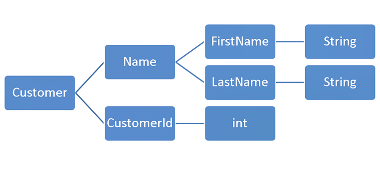

## 객체지향 생활 체조 원칙 9가지 익히기!

최근에 코드 리뷰를 <code>객체지향 생활 체조 원칙</code>를 기반으로 한다는 얘기를 처음 접했다.

객체지향 생활 체조 원칙에 대해 살펴봤는데, 기존에 오브젝트라는 책과 DDD 관련 책에서 적혀있던 내용과 더불어서 좋은 개념들이 많았다!

그래서 이번 포스팅에서는 객체지향 생활 체조에 대해서 작성한다.

## 객체지향 생활 체조 원칙

객체지향 생활 체조 원칙은 소트웍스 앤솔러지(ThoughtWorks Anthology)라는 책에 나오는 원칙이다.

아래의 9가지 원칙을 준수하면서 객체지향을 추구할 수 있다고 한다.
1. 한 메서드에 오직 한 단계의 들여쓰기(indent)만 한다.
2. else 예약어를 쓰지 않는다.
3. 모든 원시 값과 문자열을 포장한다.
4. 일급 컬렉션을 쓴다.
5. 한 줄에 점을 하나만 찍는다.
6. 줄여 쓰지 않는다(축약 금지).
7. 모든 엔티티를 작게 유지한다.
8. 3개 이상의 인스턴스 변수를 가진 클래스를 쓰지 않는다.
9. getter/setter/프로퍼티를 쓰지 않는다.

## 1. 한 메서드에 오직 한 단계의 들여쓰기(indent)만 한다.

한 메서드 if/for/while 문 등을 2 depth 이상 사용하지 않는다.

해당 부분만 지켜도 가독성이 향상되고, 메서드가 자연스럽게 분리되는 효과가 있다.

#### 기존 코드

```java
public static int operate(int[] numArray, String op) {
    int result = 0;
    if(op.equuals("+")) {
        for(int i = 0; i < numArray.length; i++) {
            result += numArray[i];
        }
        return result;
    }
    if(op.equals("*")) {
        // ..생략
    }
}
```

#### 수정 코드

```java
public static int operate(int[] numArray, String op) {
    if(op.equals("+")) {
        return sum(numArray);
    }
    // 생략
}

private static int sum(int[] numArray) {
    int result = 0;
    for(int i = 0; i < numArray.length; i++) {
        result += numArray[i];
    }
    return result;
}
```

함수는 한 가지 일만 해야 한다. 중첩 구조가 많다는 것은 함수가 하는 일이 많다는 것을 의미한다.

indent를 1로 유지함으로써 함수의 역할을 줄일 수 있게 된다.

추가로 public 메서드에는 의도만 담고 내부 로직은 private 메소드에 숨길 수 있어 유지보수성이 향상된다.

## 2. else 예약어를 쓰지 않는다.

else가 있는 코드는 의도를 파악하기 어렵다. ealry return을 통해 의도를 분명히 나타낼 수 있다.

#### 기존 코드

```java
public static int operate(int[] numArray, String op) {
    int result = 0;
    if(op.equals("+")) {
        result = sum(numArray);
    } else if(op.equals("-")) {
        result = minus(numArray);
    } else {
        result = avg(numArray);
    }
    return result;
}
```

#### 수정 코드

```java
public static int operate(int[] numArray, String op) {
    if(op.equals("+")) {
        return sum(numArray);
    } 
    if(op.equals("-")) {
        return minus(numArray);
    }
    return avg(numArray);
}
```

가독성이 증가한 것을 볼 수 있다.

예외 상황의 경우 ealry return으로 흐름에서 빨리 나가므로 유지보수가 쉬워진다는 장점도 있다.

## 3. 모든 원시 값과 문자열을 포장한다.

1번에서 indent를 나누면서 메서드를 분리했다. 그러다보면 클래스로 분리할 수 있는 부분들이 생긴다.

numArray에 음수가 오면 예외를 터트린다는 요구사항이 추가되었다.

#### 기존 코드

```java
private static int sum(int[] numArray) {
    int result = 0;
    for(int i = 0; i < numArray.length; i++) {
        int num = numArray[i];
        if(num < 0) {
            throw new RuntimeException();
        }
        result += num;
    }
    return result;
}
```

#### 수정 코드

```java
public class Positive {
    private int number;
    
    public Positive(int number) {
        if (number < 0) {
            throw new RuntimeException();
        }
        this.number = number;
    }
    
    public Poisitive add(Positive other) {
        return new Positive(this.number + other.number);
    }
    
    public int getNumber() {
        return number;
    }
}

private static Positive[] toPositives(int[] values) {
    Positive[] numbers = new Positive[values.length];
    for (int i = 0; i < values.length; i++) {
        numbers[i] = new Positive(values[i]);
    }
    return numbers;
}

private static int sum(Positive[] numbers) {
    Positive result = new Positive(0);
    for (Positive number : numbers) {
        result = result.add(number);
    }
    return result.getNumber();
}
```

이런 부분이 신규 개발자한테나 기존 개발자한테는 더더욱 낯설게 느껴질 수 있다.

하지만 도메인을 담는 객체를 만들고, 스스로를 검증하는 자율적인 객체를 만들고 보는 것에 익숙해져야 한다.

추가로 이러한 리팩토링은 Calculator와 같이 상위 클래스에 비대한 요구사항과 책임이 담기는 것을 막게 한다.

#### 의문사항

숫자의 경우 위와 같이 요구사항을 담을 수 있고, 문자열도 Password 등의 클래스를 만들어서 길이나 패턴을 검증할 수 있다.

그런데 boolean은 어떡하지..? boolean도 primitive인데.. 라는 의문점이 생겼다.

알아보니까 boolean은 가장 원시적인 값으로 일반적인 경우에서는 굳이 Wrapping 하지 않아도 된다고 한다.

## 4. 일급 컬렉션을 쓴다.

일급 컬렉션이란 Collection을 Wrapping하면서, Wrapping한 Collection 외 다른 멤버 변수가 없는 상태를 말한다.

EffectiveJava, CleanCode에서도 중요하다고 언급되는 내용이다.

```java
public class Store {

    private Set<Brand> brands;

    public Store(List<Brand> brands) {
        validSize(brands);
        this.brands = brands;
    }
    
    private void validSize(List<Brand> brands) {
        if(brands.size() >= 10) {
            throw new IllegalArgumentException("브랜드는 10개 초과로 입점할 수 없습니다.");
        }
    }
}
```

일급 컬렉션은 필요한 도메인 로직을 담을 수 있다.
- 즉, 컬렉션을 사용하는 상위 클래스에서 검증하는 것이 아니라, 자발적으로 검증할 수 있다.

추가로 List를 사용했다면 remove, removeAll과 같이 도메인에 필요하지 않은 기능까지 열리게 된다.
- 서비스에서 remove, removeAll 등을 언제든지 호출할 수 있게 된다.

## 5. 한 줄에 점을 하나만 찍는다.


## 7. 3개 이상의 인스턴스 변수를 가진 클래스를 쓰지 않는다.

인스턴스 변수가 많아질수록 클래스의 응집도는 낮아진다.

마틴 파울러는 대부분의 클래스가 인스턴스 변수 하나만으로 일을 하는 것이 적합하다고 말한다.

이 원칙은 객체지향 생활 체조 원칙 중에 가장 어려운 원칙으로 설명한다. 최대한 클래스를 많이 분리하게 강제하여 높은 응집도를 유지할 수 있게 한다.



#### 기존 코드

```java
public class Car {
    private String brand;
    private String model;
    private int year;
    private String color;
    private int currentSpeed;
    private int maxSpeed;
    private boolean engineStarted;
    private boolean lightsOn;
    private boolean wipersOn;
    private boolean parkingBrakeEngaged;
    // ...
}
```

#### 수정 코드

```java
public class Car {
    private String brand;
    private String model;
    
    public Car(String brand, String model) {
        this.brand = brand;
        this.model = model;
    }
    
    public String getBrand() {
        return brand;
    }
    
    public String getModel() {
        return model;
    }
}

public class Engine {};
public class Light {};
public class Wiper {};
public class Brake {};
// ..
```

이렇게 분리한 클래스들을 사용하는 클래스의 경우 Facade / Mediator / Aggregator 등을 활용할 수 있다.
- 여기서 말하는 인스턴스 변수는 객체 인스턴스(Service, Domain 객체, ...)가 아니라 primitive를 말하는 것이라고 생각해도 될 것 같다.
- (모든 클래스의 인스턴스 변수를 1 ~ 2개로 줄여라는 것은 아닌 것 같다.)

그리고 인스턴스 변수 뿐 아니라 파라미터도 1 ~ 2개로 줄이는 것도 도움이 된다.

## 9. 게터/세터/프로퍼티를 쓰지 않는다.


## 더 알아보고 싶으면 (강연)

자바지기 박재성님께서 진행하신 TDD 강연에서도 객체지향 생활 체조 원칙을 소개하고 있습니다.
- https://www.youtube.com/watch?v=bIeqAlmNRrA

관심이 있으시면 참고하시면 좋을 듯합니다.

## 참고
- https://williamdurand.fr/2013/06/03/object-calisthenics
- https://hudi.blog/thoughtworks-anthology-object-calisthenics/