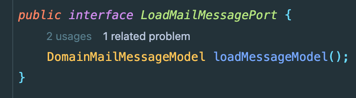

최근에 진행중인 대부분 프로젝트에서 Coverage 100%를 지향하면서 단위 테스트(Unit test)도 많아졌다.

해당 포스팅에서는 단위 테스트(Unit test)를 짜면서 얻게된 지식을 일부 공유한다.

## 리팩토링 내성

**리팩토링 내성**이란 테스트를 바꾸지 않고 프로덕트 코드를 리팩토링할 수 있어야 함을 의미한다.

쉽게 설명하면 리팩토링 과정에서 거짓 양성이 발생하지 않아야 한다.
- 거짓 양성: 기능은 잘 동작하는데 테스트가 깨지는 경우
  - 테스트가 구현과 결합도가 높은 경우 발생한다.
  - 단위 테스트를 신뢰할 수 없게 만든다.
  - 프로덕트 코드를 유연하지 못하게 만든다.

#### 구현에 의존하는 경우

최근에 **외부 모듈**을 사용한 코드에서 **모듈 버전을 변경하면서 테스트가 다량 실패**하는 현상이 발생했다.
- POJO 객체만 그대로 사용했는데 그것도 적절하지 못했던 것 같다.

아래 테스트를 보자.

```java
@ExtendWith(MockitoExtension.class)
class MailServiceTest { 
    @InjectMocks
    MailService service;
    @Mock
    LoadMailMessagePort loadMailMessagePort;

    @DisplayName("loadMailMessagePort를 호출하여 MailMessageModel을 조회한다.")
    void ItReturnMailMessageModel() {
        // given
        ExternalMailMessageModel expected = new ExternalMailMessageModel("content");
        given(loadMailMessagePort.loadMessageModel()).willReturn(expected);

        // when
        MailMessageResponse response = service.getMail();

        // then
        assertEquals(expected.getContent(), response.content());
    }
}
```

`ExternalMailMessageModel`은 설명을 위해 정의한 **외부 모듈의 모델**이다. 해당 모듈의 스펙이 변경된다면 관련된 테스트의 대부분이 깨질 수 있다.

당연히 Service 코드도 외부 모듈에 의존하므로 불안정한 영역이 된다.

#### 구현에 의존하지 않는 테스트

그래서 클린 코드 8장 - 경계([정리했던 포스팅](https://jaehoney.tistory.com/189)) 내용처럼 **Business 코드가 안정적인 Domain이나 추상화된 명세(Interface)에 의존**하고, 경계 클래스에서만 외부 모듈에 의존해야 한다.

Adapter(또는 Infrastructure) 영역에서 **외부 모델을 도메인 모델로 변환**해서 반환하도록 한다. 그래서 아래와 같이 포트(Business)에서는 **DomainModel**을 반환하도록 한다.



다시 아래 테스트를 보자.

```java
@ExtendWith(MockitoExtension.class)
class MailServiceTest {
    @InjectMocks
    MailService service;
    @Mock
    LoadMailMessagePort loadMailMessagePort;

    @DisplayName("loadMailMessagePort를 호출하여 MailMessageModel을 조회한다.")
    void ItReturnMailMessageModel() {
        // given
        DomainMailMessageModel expected = new DomainMailMessageModel("content");
        given(loadMailMessagePort.loadMessageModel()).willReturn(expected);

        // when
        MailMessageResponse response = service.getMail();

        // then
        assertEquals(expected.getContent(), response.content());
    }
}
```

이제 프로덕트 코드와 테스트 코드가 더이상 구현이나 외부에 의존하지 않는 안정적인 코드가 되었다.

## Reference

- https://tosspayments-dev.oopy.io/share/books/unit-testing