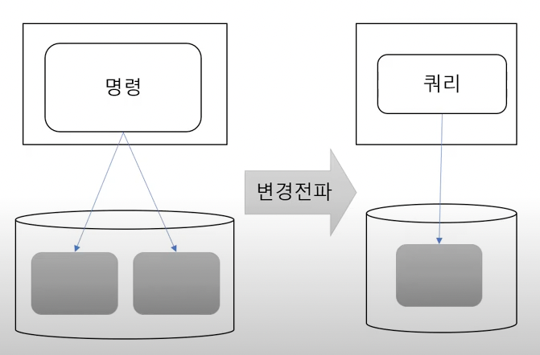
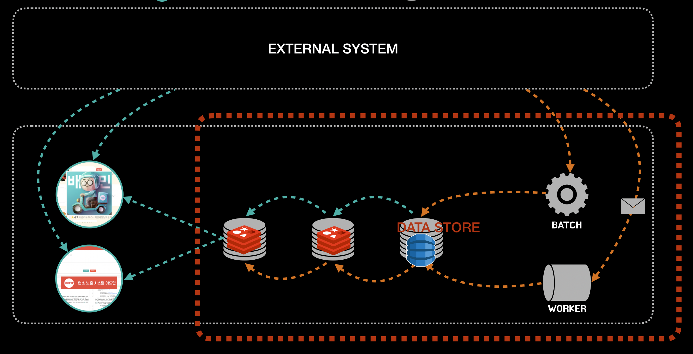

## 처리량이 서버에 미치는 영향 (+ 비동기, CQRS)

최근 CQRS를 공부해보면서 **처리량**이 서버에 미치는 영향을 알게 되었다.

우아한 형제들의 강연을 보면 위와 같은 CQRS 아키텍처를 많이 사용함을 알 수 있었다.

하지만 우아한 형제들에 다니시는 전 동료분께 여쭤보니 모든 시스템이 해당 아키텍처를 적용하는 것은 아니라고 했다.
- 전사 Default는 Slave DB를 활용하는 정도의 느낌..?
- 프론트 서버나, 상품 노출, 가게 노출 등 도메인에서는 활발하게 적용

그래서 해당 아키텍처를 적용하는 기준(?) 같은 것이 있냐고 묻자, 중요한 해답을 얻었다..!
- 앱쪽과 가깝게 위치한 서버에서는 1ms의 latency에도 매우 민감하다고 한다.
- 그 이유는 Thread가 처리를 못하고 쌓일 때 생기는 이슈때문이라고 하셨다.

## 시스템

아래는 배달의 민족의 가게 노출 시스템을 정리한 아주 도움되는 글이다.
> https://techblog.woowahan.com/2667

해당 글을 보면 가게 노출 시스템에서는 **비동기(Webflux)**를 사용하여 **최대한 빠른 시간 내에 많은 Thread를 처리**한다.

추가로 아래 그림과 같이 조회 저장소를 별도로 사용하고, **레이어링**으로 캐시 저장소를 충분히 활용하고 있다.

이 역시도 빠르게 Thread를 처리하는 데에 목적이 있다고 생각한다.
- Redis는 In-memory와 Key-Value 데이터의 특징을 가짐으로써 조회 속도가 매우 빠름
- 외부 API를 call해서 사용자 요청을 처리하는 방식이 아니라, 미리 타 시스템에서 이벤트로 제공받은 데이터로 만든 조회 모델을 시스템 내부 DB에 저장하고 꺼내어 사용하는 방식을 사용
  - 외부 시스템의 Performance에 영향을 받지 않음

그렇다면 Thread를 최대로 빠르게 처리해야 하는 이유는 무엇이 있을까..?!
- 첫 번째로 서버의 성능 이슈이다.
- 두 번째로 사용자 경험(UX)이다.
  - 이 역시도 성능 이슈에 의한 것이라 볼 수 있다.

## 서버와 처리량

Thread를 빠르게 처리하지 못하면 아래와 같은 현상이 생긴다.
- CPU 사용량이 높아짐
- Heap 메모리 사용량이 높아짐
  - (각 Thread마다 Heap 공간을 활용함)

즉, 빠르게 처리 못한 요청들이 서버 처리량을 감소 시키고, 더 요청이 쌓이게 되는 악순환이 되는 것이다.

그래서 요청을 최대한 빨리 처리해서 응답을 던지는 것이 대규모 웹서비스 환경에서 매우 중요하다.

## 참고
- https://www.youtube.com/watch?v=H1IF3BUeFb8&t=520s
- https://techblog.woowahan.com/2667/