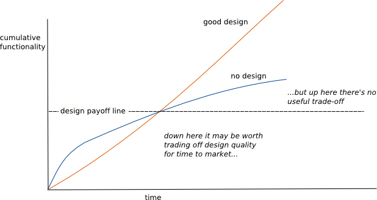

## 빠른 기능 오픈 vs 견고한 프로덕트

최근에 이직을 하고 업무를 하면서 가장 큰 고민이 있다. 코드 리뷰할 때 특히 고민된다.

개발을 하면서 아래의 선택 중 어떤 것을 선택할 지에 대한 문제이다.
1. 우선 기능이 돌아가게 만들어서 오픈하고 점진적으로 개선한다.
2. 초기에 프로젝트 설계나 테스트 코드 등에 자원을 할당한다.

현재까지의 나의 업무로 보면은 2번을 선택해왔다.

철저한 테스트와 코드 아키텍처가 추후 유지보수 작업 공수를 줄이고, 견고하고 유연한 서비스가 회사와 서비스에 대한 이미지나 사용자 경험을 증대시킨다고 생각했기 때문이다.

이직한 회사나 요즘 핫하다는 회사나 일을 잘한다는 팀은 1번을 선호하는 것 같기도 하다. 실제로 충분히 합리적이라고 생각한다.

## 사업 vs 서비스

사업 담당자의 추구
- 기능 추가
- 기능 변경
- 할인, 프로모션 등

서비스 운영자의 추구
- 리팩토링
- 코드 정리
- 테스트 코드 작성

실제로 서비스를 개발하다보면 이러한 이해관계가 자주 충돌하는 것 같다.

사업 담당자의 실적은 보통 주어진 기간 내에 고객을 얼마나 유치하고 실적을 달성하는 지로 측정될 것이다.

서비스 관점에서는 기능 추가와 기능 변경 만으로 유지보수를 하게되면 장애 발생이 증가하고 장애 대응도 늦어지고 회사와 서비스가 신뢰를 잃게 되어 큰 범위에서는 피해를 끼치게 될 수 있다. 

## 생각

내 생각을 정리해보자면 두 의견 모두 충분히 합리적이라고 생각한다. 단, 주어진 과제를 성실히 이행했을 때 말이다.

## 빠른 기능 오픈

빠른 오픈과 기능이 우선되어도 된다. 단, 장애에 최대한 빠르게 대처할 수 있어야 한다. 잦은 장애나 늦은 대응으로 회사의 이미지에 타격을 주어서는 곤란하다

틈틈히 리팩토링을 해야 한다. 코드는 집과 같다. 청소를 하지 않으면 나중에는 결국 살기가 어려워진다. 그래서 당장 외부에 티가 안나더라도 틈틈이 청소를 해야하는 것이다.

아래 지표를 보면 주기적인 리팩토링이 점진적으로 유지보수에 필요한 시간이 감소된다는 사실을 알 수 있다.

코드 아키텍처가 나쁘면 기능 수정이나 버그 fix가 또 다른 버그를 만들어 낼 가능성이 높다.

빠른 기능 오픈을 선택한다면 아래의 과제가 선행 되어야 한다.
- 장애나 결함에 민첩하게 대응해야 한다.
- 장애나 결함이 무서워서 방치하면 안되고, 주기적인 리팩토링과 정리가 되어야 한다.

## 견고한 프로덕트

견고한 프로덕트를 개발할 때는 아래의 부분에 대한 확인이 필요하다.
- 정말 견고해야 하는 지 고심해봐야 한다.
- 일정에 무리가 가선 안된다.

프로덕트를 오래 유지할 필요가 없을 수도 있고, 사용자 경험으로 부터 멀리 있을 수도 있고, 전혀 리스키하지 않을 수도 있다. 그러한 프로젝트에 테스트 커버리지를 100%, 200%, 300%를 달성하는 것은 돈을 벌어야하는 입장으로써 이해하기 어렵다.

견고한 프로젝트는 요구사항에 따라 천차만별이다. 하지만 일반적으로는 코드의 질로 인해 일정이 지체 되어선 안된다. 적시 오픈을 해서 시장 점유를 하는 것도 중요하고, 고객 및 Stakeholder 의 업무 스케줄도 존중되어야 한다.

#### 현재의 나

개인적으로는 `빠른 오픈:견고한 프로덕트`에서 중요하게 여기는 비율로 `49:51` 정도를 주고 있는 것 같다. 장애가 두려워서 인 것 같기도 하고, 엔지니어링이 하고싶은 철없는 생각일 것 같기도 하다.

일정 준수를 위해 업무 시간을 늘려서 일정과의 Gap을 줄이고 있다.

중요하게 여기는 비율이 나중에 변할 수도 있다고 생각 하고 있고 지속적으로 고민을 해봐야겠다. 

## 참고

- https://m.yes24.com/Goods/Detail/125921718
- https://www.youtube.com/watch?v=Zzylm4Xkfc8
