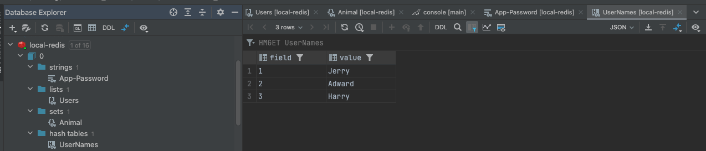
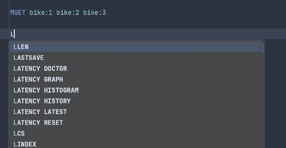
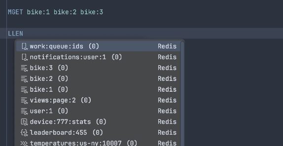

서비스를 운영하다보면 Redis, MySQL, Mongo, ElasticSearch 등 다양한 DB를 사용해야 할 일이 생긴다.

MySQL을 위한 MySQL-Workbench, MongoDB를 위한 MongoDB-Compass 등 다양한 도구를 익히면 중간에 컨텍스트 스위칭이 안되는 경험을 많이 했다.

JetBrains DataGrip을 사용하면 대부분 종류의 DB를 동일한 도구에서 관리할 수 있어서 많이 사용한다.

## Redis 지원

DataGrip 2022.3 이상 버전부터는 Redis 조회도 지원한다.

해당 기능을 사용하면 아래와 같이 Redis 데이터도 편리하게 조회하거나 명령어를 수행할 수 있다. 

아래와 같이 코드 자동완성 기능도 있어서 Command를 사용할 때보다 확실히 편리한 것 같다.

도구에 너무 익숙해지면 도구 없이 작업을 할 때 어려워진다는 단점이 있지만, 그만큼 생산성이 향상되기 때문에 적응해보는 것도 좋을 것 같다.

## 참고

- https://www.jetbrains.com/pages/datagrip-for-redis/