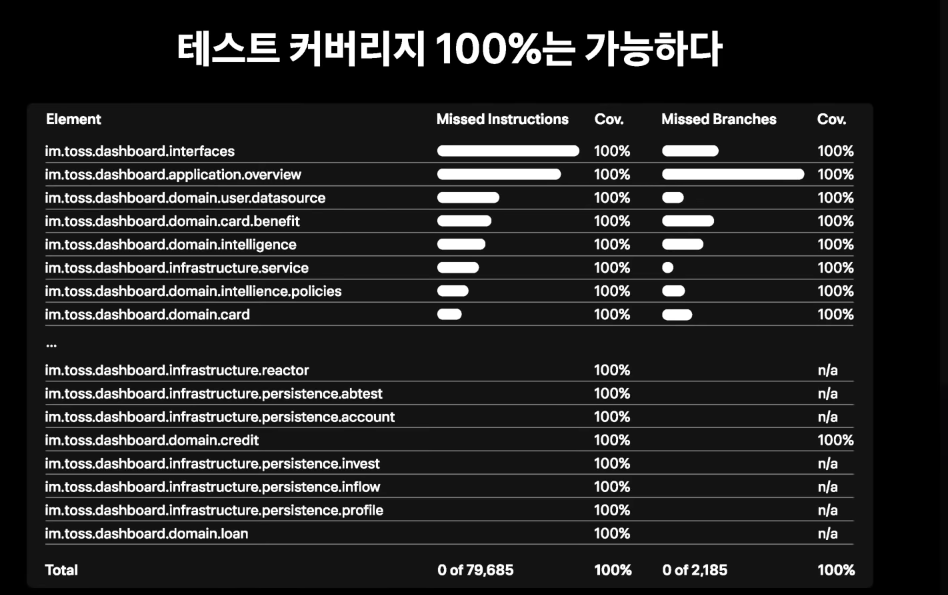
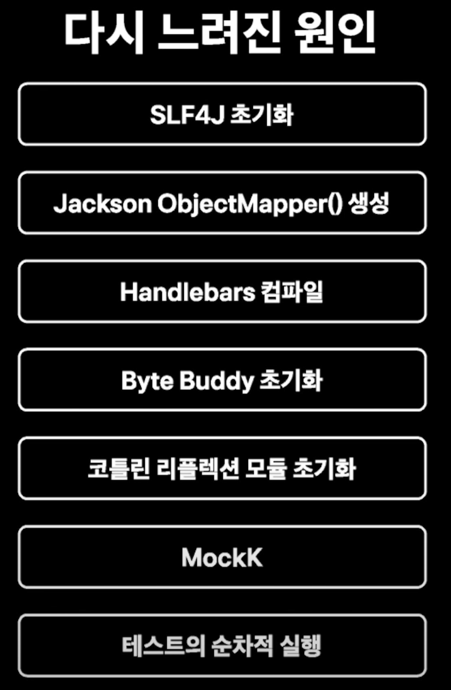
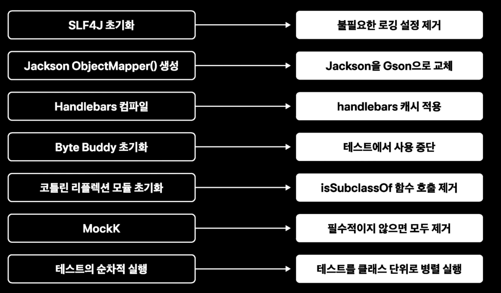

## 테스트 커버리지 100%

토스 뱅크에서는 어느 정도의 테스트 커버리지를 유지하는 것이 적당할까? 를 고민하다가 **클린 코더**라는 책에서 100% 단위 테스트를 작성해야 한다고 강력히 주장했다.

그래서 말도 안된다고 생각하기보다 실제로 해보기로 했다고 한다.

### 의외로 가능

생각보다 커버리지 100%를 충분히 할만했다고 한다.

(50%까지 100%까지 2개월이 걸렸다.)

### 유지할 수 있을까?

충분히 유지가 가능했다고 한다.
- 떨어지면 빌드가 안되니 당연한 결과..

## 이점은..?

- 자신있게 배포할 수 있다.
  - 어디서 문제가 생기면 내 코드 때문인가..? 하는 불안함이 없어짐
- 거침없이 리팩토링할 수 있었다.
  - 리팩토링에 문제가 있다면 테스트가 알려준다.
- 불필요한 프로덕션 코드가 사라진다.
  - 남아있다면 그것 또한 테스트해야 하기 때문
- 프로덕션 코드에 대한 이해도 상승
- 점점 쉬워지는 테스트 작성
  - 프로덕션 코드가 점점 테스트가 용이하도록 변해간다.
  - 이전 테스트 참고해서 작성 가능

### 테스트가 불가능한 코드..?

테스트가 불가능한 코드는 없다고 한다.

어떠한 테스트 코드도 작성할 수 있다.

### 언제..?

가능한 프로젝트 초기부터 커버리지가 높은 상태를 유지하는 것이 좋다.

늦게 적용하면 테스트를 위해 프로덕션 코드를 전반적으로 수정해야 한다.

## 느려지는 테스트

테스트가 많으면 테스트가 느려질 수 있다. 그래서 생산성도 떨어진다.
- 전체 테스트가 1분이 넘는다면 상당한 문제라고 한다.
  - 개발자가 개발을 끝낼 때마다 1분씩 기다려야 함
  - 배포 시에도 1분씩 기다려야 함

### 해결

웹 API를 테스트할 때 @SpringBootTest를 사용해서 스프링 애플리케이션 컨텍스트를 로딩할 수 있다.
- 수 초 ~ 수십 초가 걸린다.

그래서 Standalone 기능을 사용하면 스프링 애플리케이션 컨텍스트를 띄우지 않을 수 있다.

메인 애플리케이션에 대한 테스트에서는 모킹 라이브러리로 Spring을 Mocking하는 방법을 사용했다.

## 그래도 느린 테스트

Spring Application Context를 띄우지 않아도 결국 테스트가 쌓이면서 느려지게 되었고 결국 1분 이상으로 늘어나게 되었다.

아래의 원인이 있었다고 한다.

특히 Kotlin에서 Mocking Framework인 MockK가 초기화가 굉장히 느렸기 때문이라고 한다.
- 사용하는 Byte Buddy도 느렸고, 코틀린 리플렉션 모듈 초기화도 느렸다.

테스트가 순차적으로 실행되는 것도 문제였다.

### 해결

그래서 해당 문제들을 하나씩 대응해서 해결해나갔다.

여기서 Mockk의 경우 메인 Application Test에서 Spring을 Mocking하는 것 1번 이외에는 전부 제거했다고 한다.

그리고 실제로 Mock Object를 구현했다.
- (Java라면 @MockBean을 제거하고, Mock Object를 구현하는 정도로 이해하면 될 것 같다.)

결국 다시 전체 테스트가 40초 이내로 돌아왔다고 한다.

### (번외..?) 하드웨어

추가로 사내 PC 사양을 올려서 Thinkpad / Macbook 최고 사양으로 바꾸니까

2300개의 테스트가 6초 대에 이르렀다고 한다. ㄷㄷ
