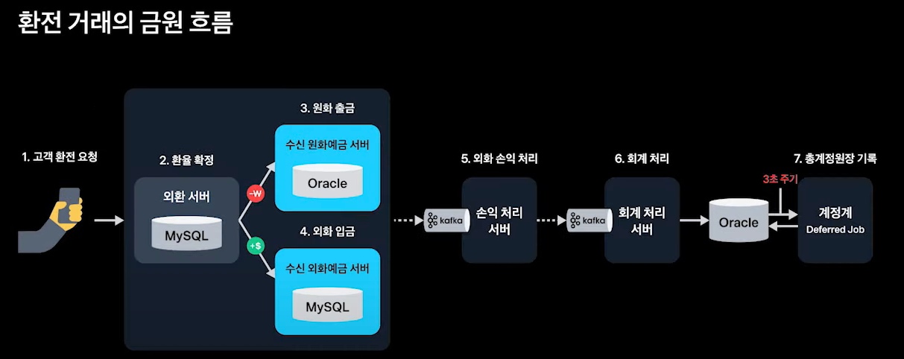

토스뱅크에서는 365일 24시간 언제 어디서나 환전 우대 100%로 환전이 가능한 서비스를 개발했다.

해당 강연의 내용을 정리한 것이다.
- https://www.youtube.com/watch?v=uWnAVYgCd0k&t=1062s

## DB 전환

대부분의 은행은 Oracle을 사용한다.

Oracle은 아래 장점을 가진다.
- 신뢰성과 안정성
  - 트랜잭션 관리, 고가용성, 복구 기능
- 확장성
  - 매우 큰 데이터 볼륨을 처리할 수 있음
- 성능
  - 복잡한 트랜잭션 처리
  - 대규모 데이터 쿼리에 효과적
- 오랜기간 축적된 노하우

단점은 아래와 같다.
- 높은 비용
- 제한적인 Scale-Out

MSA로의 전환을 했지만, DB는 단일 DB를 사용한 이유가 Oracle의 라이센스 비용 문제였다고 한다. (Oracle은 CPU 코어 수에 비례해서 라이센스 비용을 과금한다.)

그래서 DB도 마이크로 서비스로 전환하기 위해 Oracle을 대체하고 싶었다고 한다.

#### 오라클을 대체할 수 있는 기술

- 트랜잭션 관리 기술
  - Redis 분산락, Kafka SAGA 패턴 등
- 확장성
  - MySQL Replication
- 안정성
  - MySQL MVCC 기술을 사용한 동시성 제어

해당과 같이 Oracle을 대체할 수 있다고 판단했기 때문에 신규 서비스는 MSA와 MySQL로 구축하기로 결심. 이후 외환 서비스를 오픈하게 된다.

토스뱅크에서는 365일 24시간 언제 어디서나 환전 우대 100%로 환전이 가능한 서비스를 개발했다.

해당 강연의 내용을 정리한 것이다.
- https://www.youtube.com/watch?v=uWnAVYgCd0k&t=1062s

## DB 전환

대부분의 은행은 Oracle을 사용한다.

Oracle은 아래 장점을 가진다.
- 신뢰성과 안정성
    - 트랜잭션 관리, 고가용성, 복구 기능
- 확장성
    - 매우 큰 데이터 볼륨을 처리할 수 있음
- 성능
    - 복잡한 트랜잭션 처리
    - 대규모 데이터 쿼리에 효과적
- 오랜기간 축적된 노하우

단점은 아래와 같다.
- 높은 비용
- 제한적인 Scale-Out

MSA로의 전환을 했지만, DB는 단일 DB를 사용한 이유가 Oracle의 라이센스 비용 문제였다고 한다. (Oracle은 CPU 코어 수에 비례해서 라이센스 비용을 과금한다.)

그래서 DB도 마이크로 서비스로 전환하기 위해 Oracle을 대체하고 싶었다고 한다.

#### 오라클을 대체할 수 있는 기술

- 트랜잭션 관리 기술
    - Redis 분산락, Kafka SAGA 패턴 등
- 확장성
    - MySQL Replication
- 안정성
    - MySQL MVCC 기술을 사용한 동시성 제어

해당과 같이 Oracle을 대체할 수 있다고 판단했기 때문에 신규 서비스는 MSA와 MySQL로 구축하기로 결심. 이후 외환 서비스를 오픈하게 된다.

## 트랜잭션 아키텍처

아래는 환전 거래의 흐름이다.

첫 번째로 중요한 것은 트랜잭션의 범위이다. 아래 작업은 하나의 트랜잭션으로 묶여야 한다.

1. 환율 확정
2. 원화 출금
3. 외화 입금

해당 부분은 Kafka를 활용한 SAGA 패턴으로 트랜잭션을 보장한다.

그리고 이후 부분을 1개의 Oracle 서버가 아니라 MSA 패턴으로 관리하면서 아래 효과가 생겼다고 한다.

- 장점
  - 서로 간의 Dependency 감소
  - 비동기 처리로 인한 Latency 감소 (300ms -> 30ms)
  - 1개의 트랜잭션에서 많은 업무를 수행하지 않게 됨 (실패 감소, DB 부하 감소)
  - 재처리 가능
- 단점
  - 트랜잭션 관리 난이도 증가

## API 개선

아래는 외화 예금 API를 개편하면서 진행된 부분이다.

#### 동시성 제어

입금 API에서는 동시성 제어로 잔액에 대해 (Application Layer) Redis 분산락 + (DB Layer) MySQL 비관적 락을 사용한다.

Redis를 활용한 이유는 DB의 트래픽을 전면에서 받을 수 있기 때문에 빠른 응답 + DB 부하 감소 등이 목적이다.

#### 검증

외화예금 API의 경우 아래의 많은 종류의 검증이 있다.
- 계좌 상태
- 계좌 거래제한
- 고객 거래제한
- 입금 가능 금액
- 중복 거래
- ...

해당 검증은 동기적으로 처리하지 않을 수 있는 부분도 많이 존재했다. 그래서 코루틴을 활용해서 병렬적으로 다양한 검증을 수행할 수 있었다.

## 24시간 365일 무중단 서비스

일반적인 은행은 00시 근방에 거래가 불가능하다. **잔액대사** 과정 때문이다.

**잔액대사**는 매일 00시 00분에 전체 고객 계좌 잔액의 합과 전체 은행 계좌 잔액의 합이 일치하는 것을 검증하는 것이다. 

00시 00분에 잔액을 산출하기 위해 일반적인 은행에서는 아래 과정을 수행한다.
- 0시 0분 근방에 거래를 막는다.
- 0분에 전일자 스냅샷 테이블을 만든다.

이러한 과정 때문에 해당 시간에는 은행 점검으로 입/출금이 불가능하다.

토스 뱅크에는 기존의 레거시 구조와 플로우 대신 새로운 플로우를 적용해서 자정 근방에도 송금/카드결제 등을 할 수 있다.

#### 1. 원화예금 구하기
1. 00분에 전일자 스냅샷 테이블을 만든다.
2. 00분 이후 거래내역을 확인한다.
3. 거래내역을 바탕으로 잔액을 역산하여 전일자 스냅샷 테이블을 보정한다.

#### 2. 외화예금 구하기
1. 일자별&계좌별 잔액만 기록하는 테이블을 만든다.
2. 1번에서 만든 테이블을 기준으로 전일자 스냅샷 테이블을 만든다.

토스뱅크는 기술적 최적화와 데이터 관리를 통해 레거시 제약을 극복하고 24시간 거래가 가능하게 되었다.

## 테스트 자동화

- Local: 단위 테스트 코드
- Dev: E2E 테스트 활용
  - 코드가 수정되면 E2E서버가 정해진 시나리오에 맞게 API를 호출
- Live: 이상거래탐지 서비스 개발 (데이터 완결성 검증)
  - 발생하게 안되는 Case가 발생했는 지 주기적으로 확인 (중복 이자를 받거나, 해지된 계좌 거래 등)
  - 복잡한 Native Query가 수행되므로 Hadoop에 저장된 데이터 기반으로 수행

## 성능

성능이 원화송금 300ms 보다도 10배 가까이 개선된 30ms의 Latency를 얻음
- MSA 전반적인 시스템 구축
- Redis를 활용한 캐싱
- 코루틴을 활용한 병렬처리

## 느낀점

나도 핀 테크 회사를 다니고 있지만, 결제의 경우에는 DDD, 객체지향, 비동기 처리, SAGA 패턴 등을 구현하기가 어렵다고 생각했었다.

트랜잭션의 관리가 정말로 많이 중요하고, 장애 포인트가 생긴다면 회사의 막대한 손실로 직결될 수 있다. 그래서 금융권이나 결제 회사에서는 절차지향적으로 코드를 짜고 있다. '그게 어느정도 맞지 않나..?' 라고 생각하고 있었다.

결제 쪽은 보통 도메인이 매우 복잡하기에 개발자 분들도 도메인 전문가 분들이 많으시다.

그런데 이번 강연을 포함한 최근 강연들을 보고 약간 생각이 바뀌게 되었다. (Spring I/O 강연에서의 DDD 예제도 결제 서비스였다.)

 DDD, SAGA 패턴, 비동기 처리 등은 결제에서 충분히 매력적이고 유용하게 사용할 수 있을 것 같다는 생각이 들었다. 개발자의 지식이 충분히 받쳐줄 때지만 말이다.

## 참고

- https://www.youtube.com/watch?v=uWnAVYgCd0k&t

## 참고

- https://www.youtube.com/watch?v=uWnAVYgCd0k&t
