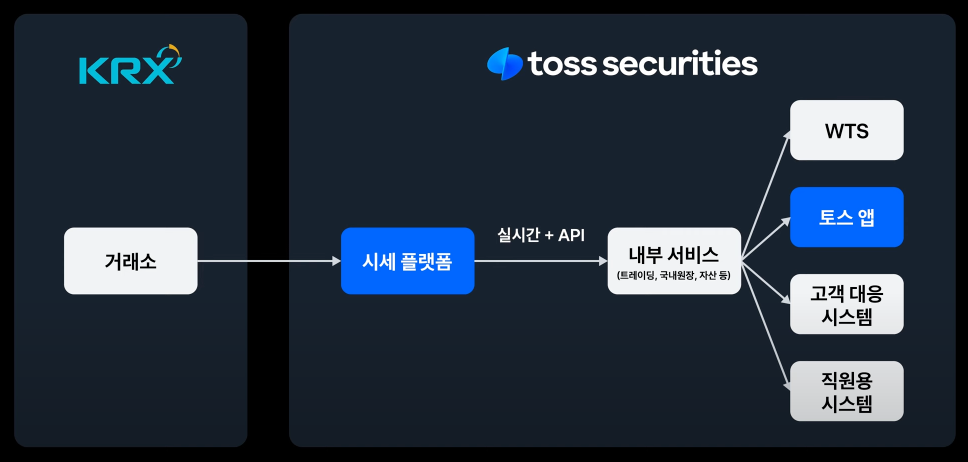
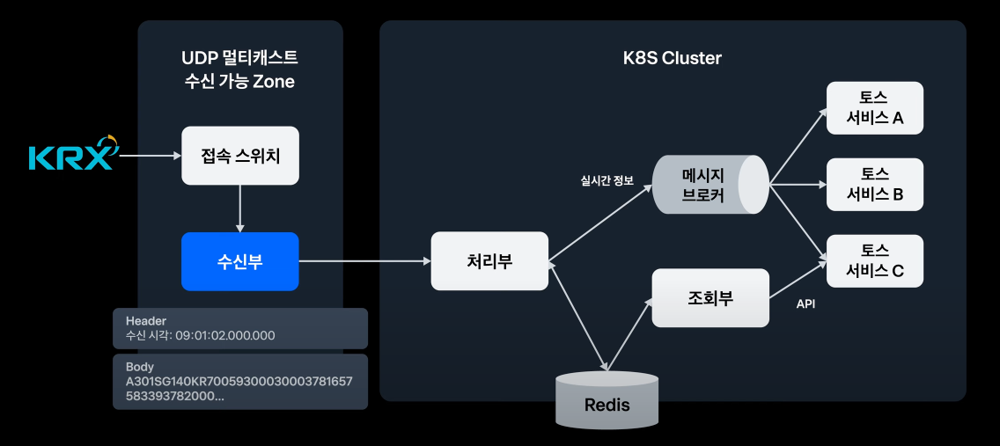
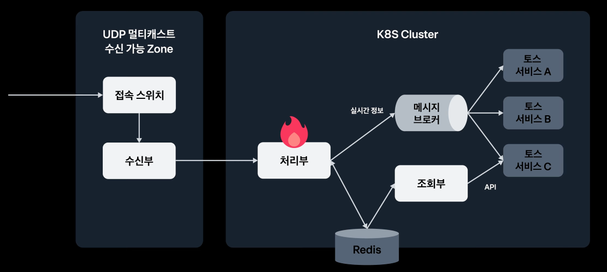
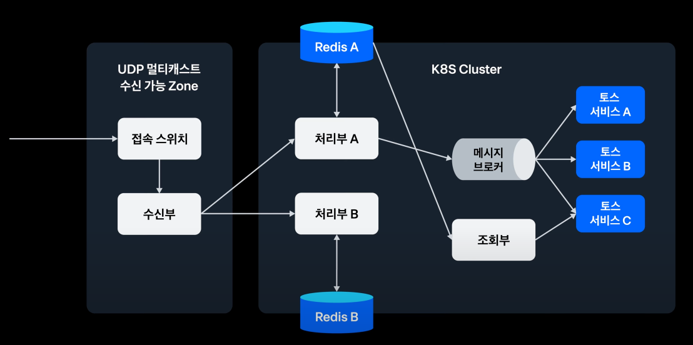
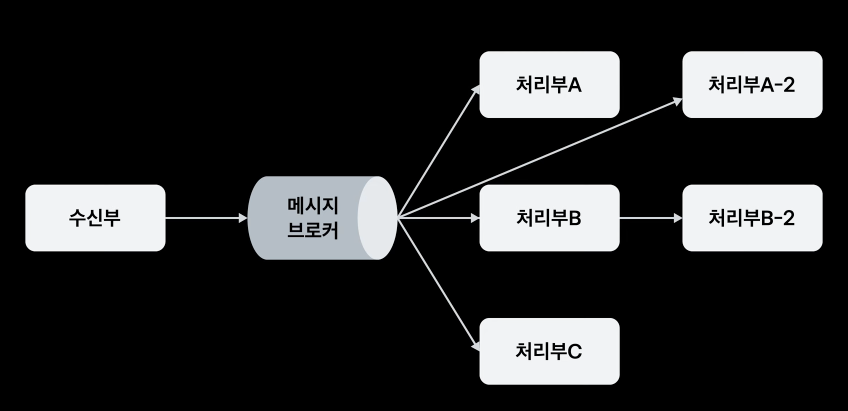
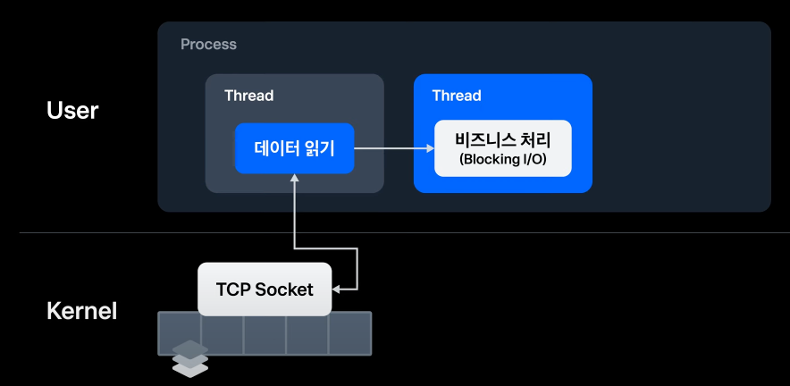
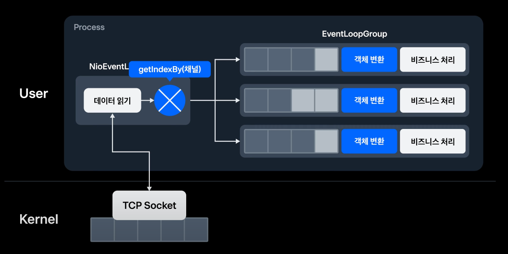
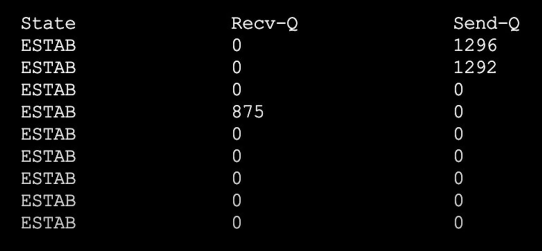
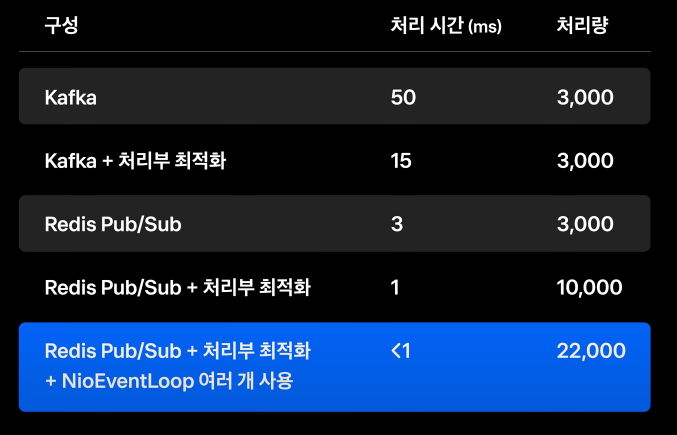

해당 포스팅에서는 토스 SLASH 23에서 실시간 데이터를 처리하는 방법에 대한 강연 내용에 바탕을 둔다.
- https://www.youtube.com/watch?v=SF7eqlL0mjw&t=41s

토스 증권에서는 KRX(한국 거래소)에서 실시간 체결가, 호가뿐 아니라 거래 정지, 공매도, 외국인 투자 현황 등을 전달받는다.

가장 중요한 것은 요청이 많은 오전 9시에 데이터가 누락되거나 밀리지 않고 처리하는 것이다.

## 시세 플랫폼

시세 플랫폼은 거래소의 데이터를 가공하고, 누적한 데이터와 결합한 후 내부 서비스에 전달한다.

여기서 더 세부적인 단위로 나누면 아래와 같다.

**수신부**는 **UDP 멀티캐스트 그룹**에 접속해서 데이터를 읽어온다.

참고로 한국 거래소에서 데이터를 읽어오는 방식은 크게 두 가지가 있다.
- UDP: 거래소가 서비스 이용자에게 시세 정보를 실시간으로 전송한다.
- FTP: 거래소가 특정 시점에 파일을 업로드 해놓으면 서비스 이용자는 그 시점에 맞춰서 시세 정보를 수신한다.

멀티 캐스트란 같은 데이터를 특정 그룹에게 보내주어야 할 때 사용하는 인터넷 프로토콜이다. 멀티 캐스트를 통해 그룹 단위로 데이터를 통신할 수 있다.

**처리부**는 비즈니스 로직이 있는 곳으로, Redis에 저장하거나 메시지 브로커를 통해 서비스에 전달한다.

비즈니스 로직 중에는 Blocking I/O가 있기 때문에 처리 시간에 가장 많은 영향을 주는 곳이다.

## 단일 장애 포인트

그림에서 보면 알 수 있듯 처리부에서 장애가 나면 사용자는 잘못된 정보를 받게 된다.

이때 **처리부를 복구하더라도 유실된 데이터들에 대한 처리가 없으므로 장애 상황은 유지된다.**

그래서 위와 같이 처리부를 이중화 하면 한 쪽에 장애가 났을 때 다른 쪽 처리부를 사용할 수 있게 된다.

## 수신부 부하

처리부 개수가 늘어나게 되면서 수신부가 데이터를 전달해야 할 대상이 선형적으로 늘어나게 된다.

그래서 위와 같이 메시지 브로커를 도입할 수 있다. 
하지만, 메시지 브로커로 인해 지연 시간이 늘어나게 될 수 있기 때문에 메시지 브로커의 선택이 중요하다.
- UDP 멀티캐스트: 라우터 설정과 k8s 설정이 필요함
- Kafka: 많이 사용되는 솔루션이지만, Redis Pub/Sub보다 지연시간이 길다.
- Redis Pub/Sub: 매우 낮은 지연시간(Queue를 사용하지 않고, 즉시 구독자에게 전송), 편리한 커맨드, 유실될 가능성 O

## Blocking I/O

처리부는 크게 보면 아래의 두 가지 역할을 한다.
- Redis Pub/Sub과 연결을 맺은 후 Socket의 수신 버퍼로부터 데이터를 읽어간다.
- 비즈니스 처리(Blocking I/O)

비즈니스 로직의 Blocking I/O 때문에 처리부에서 성능이 저하될 수 있다. 그래서 아래와 같이 비즈니스 처리는 별도 쓰레드에 위임한다.

그런데 비즈니스 로직을 MultiThread로 실행하면 순서가 틀어질 수 있다. 가령, 삼성 전자에 대한 실시간 거래가가 여러 개가 들어온다면 순서도 중요하게 된다.

그래서 처리부는 Multi Threading 대신 이벤트 루프를 사용한다. 문제는 종목 코드에 맞게 이벤트 루프에 넣어야 하는데, 이때 직렬화 즉, 부하가 발생한다는 것이다. 

그래서 Redis Pub/Sub의 Channel을 사용할 수 있다. Event Loop 개수 만큼 Redis Pub/Sub의 Channel을 나누고, 각 Event Loop에서 자신이 담당하는 Channel만 구독한다면 순서를 그대로 유지할 수 있다.

## EventLoop

EventLoop는 `ThreadPoolTaskExecutor`의 `corePoolSize = 1`, `maxPoolSize = 1`로 만들 수 있다. 그리고 DiscardOldestPolicy를 적용한다. (큐의 크기가 가득차면 맨 뒤 요소를 삭제한다. -> 실시간 데이터에 적합)

EventLoop가 1개라면 단일 스레드가 동작하는 것과 다를 바가 없다.

그러나 EventLoop가 너무 많아도 아래의 단점이 생길 수 있다.
- Context Switching으로 인한 비용 증가

그래서 EventLoop 개수는 줄이면서도 더 효율적으로 동작하는 방안이 필요하다. 그래서 아래의 3가지 방안을 적용할 수 있었다.
1. Non-Blocking I/O 사용 
    - 처리부 -> 레디스 저장 시 Blocking I/O가 발생했다.
    - ReactiveRedisTemplate을 사용하여 Event Loop가 처리 결과를 기다리지 않아도 되도록 처리
2. LocalCache 사용
    - 비즈니스 로직 중 Redis에서 과거 데이터를 조회하는 경우가 많았다.
    - 조회는 비동기 처리가 불가능하다. 그래서 매번 Redis에서 데이터를 읽는 것 보다는 로컬 캐시를 사용해서 부하를 감소
3. EventGroup 분리
    - Batch, RDB 삽입과 같은 작업은 별도 EventLoopGroup으로 분리

## 그럼에도 처리량 동결 현상..

그럼에도 높은 트래픽 상황에서 처리량이 더 이상 올라가지 않는 상황이 발생한다면

`nestat -na | grep <포트번호>` 혹은 `ss-t dst :<포트번호>`로 Socket의 수신 버퍼, 송신 버퍼를 확인한다.

#### Recv-Q > 0

이때 Recv-Q가 지속적으로 0보다 크다면 데이터가 처리되지 못하고 쌓이는 것을 의미한다.

이때 아래의 방법을 사용할 수 있다.

1. NioEventLoop 확인
    - 데이터 변환, 객체 생성, 로깅 등 사소한 처리도 **제거** 혹은 **다른 스레드에 위임**
2. CPU Profiling
    - CPU 사용량을 확인해서 불필요한 Thread를 찾아내어 제거하거나 개수를 줄이면 ContextSwitching이 줄어들게 된다.
    - 예를 들어 기본적으로 할당되는 Spring의 Tomcat Thread를 1로 줄이는 것
3. NioEventLoop를 여러 개 사용하기;
    - Socket 버퍼 읽기 향상

## 결과

지금까지 살펴본 내용들로 개선한 결과는 아래와 같다.

22,000 TPS 상황에서 1ms 이하 처리 시간이라는 결과를 얻을 수 있었다고 한다.

## 참고

- https://www.youtube.com/watch?v=SF7eqlL0mjw&t=41s