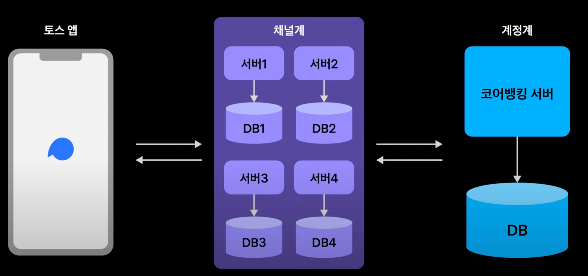

## 토스 뱅크의 정합성 문제 겉핥기!

해당 포스팅에서는 아래 강연의 내용을 참고해서 작성합니다.
- 참고: https://www.youtube.com/watch?v=v9rcKpUZw4o&t=928s

## 채널계와 계정계

왜 은행에서는 1개월, 3개월, 6개월 등 기간에 따른 입금+출금 내역을 조회할 수는 있지만, 무한 스크롤 UI를 제공하지 않을까?

일반적으로 은행 시스템은 아래 구조로 분리되어 있다.

- 계정계 - 실제로 유저의 돈을 다루며, 원본 데이터가 저장됨 (아주 높은 신뢰도 요구)
- 채널계 - 유저의 요청을 직접 받아 계정계로 전달

토스뱅크에서는 채널계는 여러개의 서버와 여러개의 DB로 분리되어 있다.
- 서버의 Scaleout이 용이하고, DB 부하가 커지면 DB를 분리하기 쉽다. 
- 트랜잭션 처리가 불편하다.

계정계의 경우 아주 높은 신뢰성을 요구하기 때문 하나의 서버 앱과 하나의 DB 서버를 가진다.
- 급증하는 트래픽을 그대로 소화하기엔 분리하다.
- 트랜잭션 처리가 유리하다.

### 거래 내역 조회

일반적으로 고객이 거래 내역을 조회할 시 채널계는 요청을 받아서 계정계에 전달하고, 그 결과를 다시 앱으로 전달하게 된다.

계정계는 광범위한 거래내역을 적은 부하로 내려주긴 어렵다. 그런 요청을 최소화하기 때문에 UI에서 조회 범위를 수개월 정도로 한정하는 것이 현명하다고 한다.

그렇지만 토스뱅크는 무한스크롤을 사용하고 있다.

왜냐하면 토스뱅크는 채널계에서 계정계인 코어뱅킹 서버의 데이터를 동기화하고 있다.
- 이때 코어뱅킹 서버의 부하가 너무 커질 수 있다.

토스에서는 계정계의 부하를 어떻게 처리할까..?

## 메시징

토스 뱅크에서는 Kafka를 활용해서 이를 해결한다.

매번 전체 데이터를 동기화하려면 큰 부하가 필요하다.

그래서 입금/출금시마다 Event를 발행하고, 각 채널계에서 해당 Event를 구독해서 DB에 저장한다.
- 정합성만 맞는다면 계정계에 요청을 할 필요가 없게 된다.
- 예외 상황에는 어떻게 하지..?

### 예외 상황

송금 요청에 대한 타임아웃이 발생했다고 가정해보자.

유저는 송금이 실패했다는 응답으로 인해, 다시 한번 송금을 시도할 수 있다.

이러한 부분을 막기 위해 송금 서버는 코어뱅킹 서버에 송금 요청을 보내기 전에 송금 요청을 DB에 저장한다. 그리고 완료되지 않는 송금 요청이 있는 유저가 다시 송금을 요청하면 거절한다.

이로써 중복으로 송금되는 문제를 막을 수 있다.

### 예외 상황2

그렇지만 또 다른 문제가 생길 수 있다.

송금 서버에서 요청한 송금 요청이 코어뱅킹 서버로 도달조차 못했다 영원히 송금하지 못하는 문제가 발생한다.
- (완료되지 못한 송금 요청이 송금 DB에 남아있게 되기 때문)
- 코어 뱅킹 서버의 병목 문제로 송금 DB 트랜잭션과 송금 요청을 별도의 트랜잭션으로 분리한 듯하다.

토스 뱅크는 이를 해결하고자 주기적으로 송금 서버는 코어뱅킹 서버로부터 송금 상태를 조회하고, 송금이 아예 없는 경우 송금 DB의 잉여 송금을 실패로 처리한다.

### 예외 상황3

희박하지만 뒤늦게 송금 요청이 코어뱅킹 서버로 전달되어, 실제 송금은 성공했지만 송금 DB에는 실패로 처리될 수 있는 가능성이 존재한다.

이 방식은 타임아웃 설정을 활용해서 해결한다.
- 송금 서버와 코어뱅킹 서버가 타임아웃 시간을 1분으로 약속하고, 송금 요청에는 요청 시간을 포함해서 보낸다.
- 송금 실패 처리 이후에 온 송금 요청은 거절하게 된다.

## 메시지 소비 실패

그럼 송금 요청이 아니라 메시지 소비가 실패할 떄는 어떻게 될까..?

저번에 SLASH 강연에서 토스에서는 Kafka 실패에 대한 재처리 시 지수 백오프를 사용한다고 했다. 지수 백오프로 정해진 횟수만큼 재시도를 하고도 모두 실패한 경우 더이상 재시도를 하지 않는다.

대신 DLQ에 실패한 메시지를 저장한 후, 개발자가 처리를 수정한 후 다시 DLQ를 컨슘하는 방식으로 해결하고 있다.

## 송금 이력 누락 문제

메시지 소비에 실패하고 재처리하는 과정에서 순서가 꼬일 수 있다.
- 잔액 조회가 마이너스가 될 수도 있는 상황이 발생할 수 있다.

아래는 500원 입금이 동기화되기 전에 거래내역이 조회되어 잔액이 -100원으로 표시되는 케이스이다.

일련번호를 Kafka 메시지에 담으면 해당 메시지의 송금 내역뿐만아니라 그 이전에 다른 거래가 있었는지도 판단할 수 있다.

따라서 일련번호 순으로 동기화해서 과거 내역이 누락되지 않음을 보장할 수 있다.

### 최신화가 안되는 문제

유저가 100원 출금했고 성공했다는 메시지를 받았다고 생각해보자. 이때 거래 내역에서 100원을 출금한 내역이 없다면 당황하게 될 수 있다.

이 문제는 간단히 해결할 수 있다.

유저가 거래내역을 조회할 때 송금 서버에서는 송금 DB에서 아직 진행중인 거래내역을 확인한 후, 아직 진행중인 거래내역이 있다면 그 즉시 계정계와 거래내역을 동기화한다.

추가로 최후의 수단으로 동기화 버튼을 통해 유저가 직접 동기화를 실행할 수 있다. 

