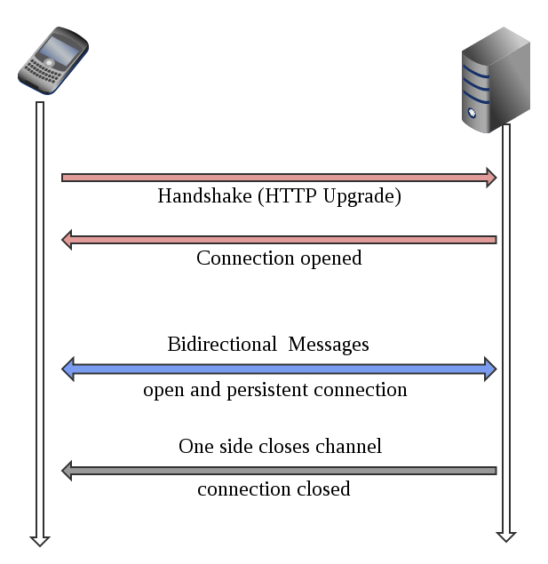

WebSocket(WebSocket)은 클라이언트와 서버를 연결하고 실시간으로 통신이 가능하도록 하는 통신 프로토콜이다.

WebSocket은 TCP 접속에 전이중(duplex) 통신 채널을 제공한다. 쉽게 말해, Socket Connection을 유지한 채로 실시간 양방향 통신이 가능하다.

아래 서비스에서 대표적으로 웹소켓을 많이 사용한다.
- SNS
- 실시간 채팅
- 화상 회의
- 실시간 협업 툴
- 온라인 게임
- 증권, 거래소

예시를 보면 동시간 접속자 수가 많으며, 실시간 데이터가 아주 많이 오간다는 것을 알 수 있다.

## vs HTTP

먼저 일반적으로 사용하는 HTTP 프로토콜과의 차이를 알아보자.

### 1. State

**HTTP**는 단방향 통신이다. 클라이언트가 서버로 요청을 보내면 응답을 받는 구조로 동작하며, 어떠한 상태도 보관하지 않는다.(Statsless)

서버는 클라이언트에게 일방적으로 데이터를 전달할 수 없다.

즉, 일반적인 HTTP 요청만으로는 웹 알림을 구현할 수 없다. 그래서 클라이언트 측에서 자동 새로고침을 구현하거나, 특정 API로 일정 주기로 Call을 보내고 동작하도록 프로그래밍을 해야 한다. 이를 **Polling 방식**이라 한다. 

**WebSocket**은 HTTP와 다르게 상태를 가진다.(Stateful)

클라이언트와 서버가 한 번 연결되면 해당 커넥션을 계속 사용해서 서로 간 자유롭게 통신이 가능하다.

### 2. Protocol

웹소켓의 경우 최초 접속 시 HTTP 프로토콜을 이용하지만, 그 이후에는 자체적인 WebSocket 프로토콜로 통신한다.

WebSocket 프로토콜은 header가 상당히 작아서 오버헤드가 작다는 특징이 있다.

### 3. Uri

HTTP로 통신 시 주소가 `http://www.abc.com`이었다면, WebSocket 통신에서는 `ws://www.abc.com`이 된다.

## vs Socket

일반적으로 **소켓(Socket)**이라고 하면  네트워크를 통해 서로 다른 두 개의 프로세스 가 통신하는 접점을 얘기한다.

소켓은 TCP/UDP를 기반으로 사용할 수 있다.

**WebSocket**은 소켓을 웹 애플리케이션에서 실시간 양방향 통신을 위해 HTTP 통신(80, 443 포트)을 기반으로 사용한다.

즉, WebSocket도 TCP를 기반으로 한 소켓의 종류이며, Socket과 WebSocket은 용어 관점에서 OSI 레이어가 다르다고 볼 수 있다. (Socket 4-Layer, WebSocket 7-Layer)

## 동작 방식



엡소켓도 TCP 연결이므로 HandShake를 한다.

이후 연결이 맺어지면 데이터를 통신하다가, 어느 한쪽이 커넥션을 끊으면 연결이 사라진다.

### 본문

요청 본문에는 아래와 같이 Upgrade: websocket을 담아서 보내야 한다.

```http request
GET /chat HTTP/1.1 
Host: server.example.com 
Upgrade: websocket 
Connection: Upgrade 
Sec-WebSocket-Key: x3JJHMbDL1EzLkh9GBhXDw== 
Sec-WebSocket-Protocol: chat, superchat 
Sec-WebSocket-Version: 13 
Origin: <http://example.com>
```

응답에는 Status Code 101로 Switching Protocols를 담아서 보낸다.

```http response
TTP/1.1 101 
Switching Protocols Upgrade: websocket 
Connection: Upgrade 
Sec-WebSocket-Accept: HSmrc0sMlYUkAGmm5OPpG2HaGWk= 
Sec-WebSocket-Protocol: chat
```

## 단점은..?

이제 WebSocket 방식이 어떤 문제를 해결하기 위한 것인지 알았다.
- 커넥션을 한 번만 맺으므로 HTTP 요청 및 응답으로 인한 오버헤드를 줄일 수 있다.
- 실시간으로 양방향 통신이 가능하다.

즉, WebSocket에는 아래의 단점이 있다.
- 연결이 끊어졌을 때의 처리를 직접 구현해야 한다.
- 브라우저 별로 지원하는 웹소켓 버전이 다르며, 모든 브라우저가 WebSocket을 지원하지는 않는다.
- 서버는 수많은 커넥션을 유지해야 하므로 자원을 많이 사용할 수 있다.
  - 실시간으로 많은 데이터가 오가지 않는다면 필요 시 연결을 하는 게 비용적으로 이득

## 참고
- https://yuricoding.tistory.com/134
- https://grapestore.tistory.com/143
- https://i-hope9.github.io/2020/12/08/SpringBoot-Netty-1-Background.html