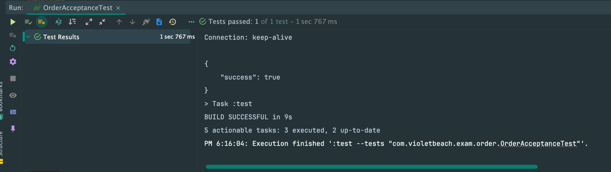
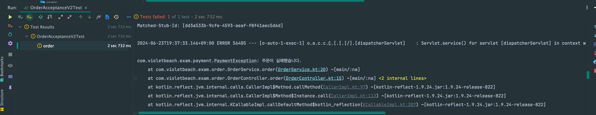

해당 포스팅에서는 테스트 시 Web 영역을 어떻게 Mocking 할 지에 대해 다룬다.

## 통합테스트

요즘은 단위 테스트를 넘어서 통합테스트/인수테스트/E2E테스트를 많이 구성한다.

외부 API를 호출하는 코드가 있다. 해당 로직을 Mocking할 때 어떻게 할 지 생각해보자.

### Product 코드

예시를 위해 제작한 주문 시스템의 코드를 보자.

```kotlin
@RestController
class OrderController(
    private val orderService: OrderService,
) {
    @PostMapping("/order")
    fun order(
        @RequestBody orderRequest: OrderRequest,
    ): OrderResponse {
        orderService.order(orderRequest.userId, orderRequest.productId)
        return OrderResponse(isSuccess = true)
    }
}
```

아래는 주문 서비스이다. 주문 서비스는 결제 서비스를 호출한다.

```kotlin
@Service
class OrderService(
    private val productService: ProductService,
    private val paymentService: PaymentService,
) {
    fun order(
        userId: Long,
        productId: Long,
    ) {
        val product = productService.get(productId)
        productService.verify(product)
        val paymentResult = paymentService.payment(userId, product.amount)
        if (!paymentResult.isSuccess) {
            throw PaymentException("주문이 실패했습니다.")
        }
        // 주문 로직
        println("주문 완료!")
    }
}
```

아래는 결제 서비스이고, 외부 API를 호출한다.

```kotlin
@Service
class PaymentService(
    private val paymentApiClient: PaymentApiClient,
) {
    fun payment(
        userId: Long,
        amount: Amount,
    ): PaymentResult {
        val request = PaymentRequest(userId, amount)
        return paymentApiClient.payment(request)
    }
}
```

## 테스트 코드

테스트 코드는 아래와 같다.

통합 테스트를 할 때 일반적인 MockMvc를 사용할 수도 있고, RestAssured를 사용할 수 있고, Cucumber를 사용할 수도 있다.

여기서는 RestAssured를 사용해서 인수 테스트를 구성했다.

```kotlin
class OrderAcceptanceTest : BaseAcceptanceTest() {
    @Test
    @DisplayName("사용자는 상품을 주문할 수 있다.")
    fun order() {
        val response = 뿌링클을_주문한다()
        val 응답_데이터 = 주문_응답(response)
        assertThat(응답_데이터.isSuccess).isEqualTo(true)
    }

    fun 뿌링클을_주문한다(): ExtractableResponse<Response> = invokePost("/order", 뿌링클_1마리_주문_요청())

    fun 주문_응답(response: ExtractableResponse<Response>) = response.`as`(OrderResponse::class.java)
}

fun 뿌링클_1마리_주문_요청(): OrderRequest = OrderRequest(testUserId, 1L)
```

해당 테스트 클래스가 상속하는 `BaseAcceptanceTest`는 다음과 같다.

```kotlin
@ExtendWith(MockitoExtension::class)
@SpringBootTest(webEnvironment = SpringBootTest.WebEnvironment.RANDOM_PORT)
class BaseAcceptanceTest {
    @LocalServerPort
    val port: Int? = null

    @MockBean
    lateinit var paymentApiClient: PaymentApiClient

    @BeforeEach
    fun setup() {
        RestAssured.port = port!!

        given(paymentApiClient.payment(any(PaymentRequest::class.java)))
            .willReturn(PaymentResult(true))
    }
}

```

일반적으로도 위 코드처럼 외부 API를 Mocking할 때 Service/Adaptor를 모킹하는 경우가 많다. 그런데 한 가지 의문점이 든다.

'이게 정말 필요한 커버리지를 보장하는 테스트 코드인가..?'

테스트 커버리지가 100%라도 안전하지 못할 수 있는 이유도 여기서 나온다.

## Web 영역

Web 영역이라고 하면 아래 영역을 포함한다.
1. Request를 직렬화
2. Response를 역직렬화
3. 네트워크 통신

하지만 저런 방식으로 Mocking 하면 세가지 영역 중 어느것도 커버되지 않는다. 

Product 코드에는 아래 설정이 존재한다.

```kotlin
@Configuration
class ObjectMapperConfig {
    @Bean
    fun objectMapper(): ObjectMapper = ObjectMapper()
}
```

ObjectMapper의 Naming 전략은 현재 CamelCase이다. 즉, 외부 API와 통신도 CamelCase로 통신을 한다.

ObjectMapper의 Naming 전략을 변경해보자.

```kotlin
@Configuration
class ObjectMapperConfig {
    @Bean
    fun objectMapper(): ObjectMapper =
        ObjectMapper()
            .setPropertyNamingStrategy(PropertyNamingStrategies.SNAKE_CASE)
}
```

이제 ObjectMapper가 통신할 때 SnakeCase로 통신한다. 즉, 기존에 PaymentApi는 CamelCase를 사용하고 있었으므로 테스트가 깨져야 정상이다.



하지만 테스트는 정상적으로 통과한다.

ApiAdaptor를 Mocking 하면서 더 이상 직렬화/비직렬화가 실행되지 않았고, 이 부분은 테스트 코드로 잡을 수 없게 되었기 때문이다.   

## WireMock

WireMock을 사용하면 특정 빈을 모킹하지 않고도 테스트할 수 있도록 Stub Server를 제공한다.

즉, 실제로 직렬화/역직렬화, 네트워크 요청까지도 테스트에 커버할 수 있다는 말이다.

`WireMock`은 `Spring Cloud`에서도 스프링 환경에서 WireMock 사용을 위해 라이브러리를 지원하고 있다.

먼저 해당 라이브러리의 의존성을 추가한다.

```kotlin
implementation("org.springframework.cloud:spring-cloud-contract-wiremock:4.1.3")
```

첫 번째로 API 호출 url을 아래와 같이 세팅한다.

```yaml
apis:
  payment:
    url: localhost:${wiremock.server.port}
```

이후 `/payment`를 호출했을 때 응답을 아래 폴더에 정의한다. `test/resources/__files//payload/payment-response.json`에 정의한다.

```json
{
  "success": true
}
```

아래에서 Mocking 서버를 설정하는 메서드를 정의한다.

```kotlin
class WireMockContext {
    companion object {
        fun setupPaymentApi() {
            stubFor(
                WireMock
                    .post(WireMock.urlMatching("/payment"))
                    .willReturn(
                        WireMock
                            .aResponse()
                            .withStatus(HttpStatus.OK.value())
                            .withHeader("Content-Type", MediaType.APPLICATION_JSON_VALUE)
                            .withBodyFile("payload/payment-response.json"),
                    ),
            )
        }
    }
}
```

이제 `PaymentApiClient`를 Mocking하는 부분을 없애고 해당 메서드를 호출하기만 하면 된다.

```kotlin
@AutoConfigureWireMock(port = 0)
@SpringBootTest(webEnvironment = SpringBootTest.WebEnvironment.RANDOM_PORT)
class BaseAcceptanceV2Test {
    @LocalServerPort
    val port: Int? = null

    @BeforeEach
    fun setup() {
        RestAssured.port = port!!

        WireMockContext.setupPaymentApi()
    }
}
```

이제 실제로 테스트를 실행해보면 `PaymentApiClient`를 실제로 호출해서 요청을 한다. 그래서 직렬화 전략이 SnakeCase일 경우 아래와 같이 테스트가 실패한다.

`isSuccess` 필드가 역직렬화에 실패해서 기본 값인 false가 들어가 테스트가 실패하게 된다.



WireMock을 사용함으로써 직렬화/역직렬화 및 네트워크 통신에서의 문제도 잡을 수 있게 된 것이다.

## 추가 - 통합 테스트의 범위

위에서 말한 것은 통합테스트의 범위에 따라 다르다. 만약 직렬화/역직렬화 및 네트워크 통신을 포함한 범위를 테스트 하고자 한다면 WireMock을 사용해서 서버 자체를 Stub 하는 방식이 좋다.

추가로 고려해야 할 점은 해당 프로젝트 자체의 Input/Output도 고려해야 한다는 점이다.

```kotlin
class OrderAcceptanceTest : BaseAcceptanceTest() {
    @Test
    @DisplayName("사용자는 상품을 주문할 수 있다.")
    fun order() {
        val response = 뿌링클을_주문한다()
        val 응답_데이터 = 주문_응답(response)
        assertThat(응답_데이터.isSuccess).isEqualTo(true)
    }

    fun 뿌링클을_주문한다(): ExtractableResponse<Response> = invokePost("/order", 뿌링클_1마리_주문_요청())

    fun 주문_응답(response: ExtractableResponse<Response>) = response.`as`(OrderResponse::class.java)
}

fun 뿌링클_1마리_주문_요청(): OrderRequest = OrderRequest(testUserId, 1L)
```

해당 테스트는 Input, Output 모두 특정 Object를 사용하고 있고, 직렬화/역직렬화는 빈으로 정의된 ObjectMapper를 따를 것이다.

만약 ObjectMapper의 전략이 바뀐다면 Product / Test 환경 모두 전략이 함께 따라갈테니 버그를 잡을 수 없고, 테스트는 성공할 것이다.

```kotlin
class OrderAcceptanceV2Test : BaseAcceptanceV2Test() {
    @Test
    fun order() {
        val response = 뿌링클을_주문한다()

        val 응답_데이터 = response.`as`(Map::class.java)
        assertThat(응답_데이터.get("is_success")).isEqualTo(true)
    }

    fun 뿌링클을_주문한다(): ExtractableResponse<Response> = invokePost("/order", 뿌링클_1마리_주문_요청())

    fun 뿌링클_1마리_주문_요청() {
        val map = HashMap<String, Any>()
        map.put("user_id", testUserId)
        map.put("product_id", 1)
    }
}
```

그래서 인수 테스트를 할 때는 `Map` 등을 사용해서 Input, Output을 통신하는 데이터 그대로 사용하는 것이 더 안전한 테스트가 된다.
- ATDD를 할 때 별도의 프로덕트 코드 없이 테스트를 먼저 작성할 때도 큰 도움이 된다.


### Reference

-   [https://wiremock.org/docs/stubbing/](https://wiremock.org/docs/stubbing/)
-   [https://memo-the-day.tistory.com/10](https://memo-the-day.tistory.com/10)